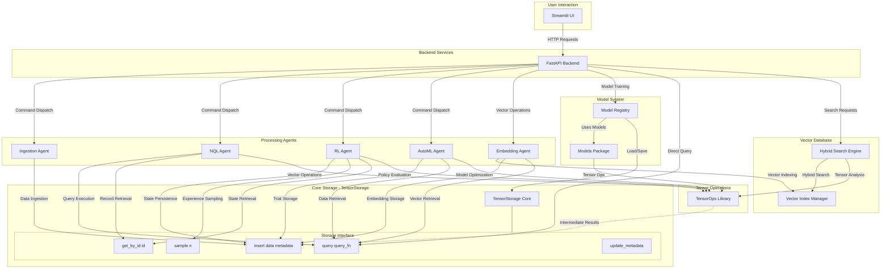

# Tensorus: Agentic Tensor Database/Data Lake

[](https://opensource.org/licenses/MIT)
[](https://www.python.org/downloads/)
[](https://hub.docker.com/r/tensorus/tensorus)
[](https://docs.tensorus.com/api)

**Tensorus** is a production-ready, specialized data platform focused on the management and agent-driven manipulation of tensor data. It offers a streamlined environment for storing, retrieving, and operating on tensors at scale, providing the foundation for advanced AI and machine learning workflows.

## 🎯 What Makes Tensorus Special

Tensorus bridges the gap between traditional databases and AI/ML requirements by providing:

- **🧠 Intelligent Agent Framework** - Built-in agents for data ingestion, reinforcement learning, AutoML, and embedding generation
- **⚡ High-Performance Tensor Operations** - 40+ optimized operations with 10-100x performance improvements
- **🔍 Natural Language Queries** - Intuitive NQL interface for tensor discovery and analysis
- **📊 Complete Observability** - Full computational lineage and operation history tracking
- **🏗️ Production-Grade Architecture** - Enterprise security, scaling, and deployment capabilities

The core purpose of Tensorus is to **simplify and accelerate** how developers and AI agents interact with tensor datasets, enabling faster development of automated data ingestion, reinforcement learning from stored experiences, AutoML processes, and intelligent data utilization in AI projects.

## 🚀 Quick Start (3 Minutes)

```bash
# Install Tensorus
pip install -e .

# Start the development server
python -m uvicorn tensorus.api:app --reload

# Access the API documentation at http://localhost:8000/docs
# Or the Swagger UI at http://localhost:8000/redoc
```

```python
import tensorus
import numpy as np

# Initialize Tensorus
ts = tensorus.Tensorus()

# Create a tensor
data = np.random.rand(3, 3)
tensor = ts.create_tensor(data, name="example_tensor")

# Perform operations
result = tensor.transpose()
print(result)
```

## 📚 Documentation

For comprehensive documentation, including user guides and examples, please visit our [documentation site](https://docs.tensorus.com).

### Interactive API Documentation

Access the interactive API documentation when the server is running:

- **Swagger UI**: `http://localhost:8000/docs` - Interactive API exploration with "Try it out" functionality
- **ReDoc**: `http://localhost:8000/redoc` - Clean, responsive API documentation

### Quick Links
- [Getting Started Guide](docs/user_guide.md) - Learn the basics of Tensorus
- [Examples](examples/) - Practical code examples
- [Deployment Guide](docs/deployment.md) - Production deployment instructions

# Store tensors with rich metadata
tensor_id = client.store_tensor(
    dataset="my_dataset",
    tensor=np.random.rand(100, 100), 
    metadata={"type": "random_matrix", "source": "demo"}
)

# Query using natural language
results = client.query("find tensors where metadata.type = 'random_matrix'")
print(f"Found {len(results)} matching tensors")

# Execute tensor operations
product = client.matrix_multiply(tensor_id, tensor_id)
print(f"Matrix product shape: {product.shape}")
```

## 📖 Comprehensive Documentation

### 📚 Learning Resources
- **🎓 [Documentation Hub](docs/index.md)** - Central portal with guided learning paths for all skill levels
- **🚀 [Getting Started Guide](docs/getting_started.md)** - Complete 15-minute tutorial with real examples
- **💡 [Use Case Examples](examples/)** - Real-world implementations and practical guides

### 🔧 Technical References  
- **🔍 [Complete API Reference](docs/api_reference.md)** - Full REST API documentation with code samples
- **🏭 [Production Deployment](docs/production_deployment.md)** - Enterprise deployment strategies and operations
- **⚡ [Performance & Scaling](docs/performance_benchmarks.md)** - Benchmarks, optimization, and capacity planning

### 🏢 Business & Strategy
- **🎯 [Executive Overview](docs/executive_overview.md)** - Product positioning, market analysis, and business value
- **📊 [Architecture Guide](docs/index.md#architecture-highlights)** - System design and technical architecture

## Table of Contents

- [Key Features](#key-features)
- [Project Structure](#project-structure)
- [Demos](#demos)
- [Architecture](#architecture)
- [Getting Started](#getting-started)
  - [Prerequisites](#prerequisites)
  - [Installation](#installation)
  - [Running the API Server](#running-the-api-server)
  - [Running the Streamlit UI](#running-the-streamlit-ui)
  - [Model Context Protocol Integration](#model-context-protocol-integration)
  - [Running the Agents (Examples)](#running-the-agents-examples)
- [Docker Deployment](#docker-deployment)
- [Environment Configuration](#environment-configuration)
- [Production Deployment](#production-deployment)
- [Testing](#testing)
- [Using Tensorus](#using-tensorus)
  - [API Basics](#api-basics)
  - [Authentication Examples](#authentication-examples)
  - [NQL Query Example](#nql-query-example)
  - [API Endpoints](#api-endpoints)
  - [Vector Database Examples](#vector-database-examples)
  - [Request/Response Schemas](#requestresponse-schemas)
  - [Dataset API Examples](#dataset-api-examples)
  - [Dataset Schemas](#dataset-schemas)
- [Metadata System](#metadata-system)
- [Streamlit UI](#streamlit-ui)
- [Natural Query Language (NQL)](#natural-query-language-nql)
- [Agent Details](#agent-details)
- [Tensorus Models](#tensorus-models)
- [Basic Tensor Operations](#basic-tensor-operations)
- [Tensor Decomposition Operations](#tensor-decomposition-operations)
- [Vector Database Features](#vector-database-features)
- [Completed Features](#completed-features)
- [Future Implementation](#future-implementation)
- [Contributing](#contributing)
- [License](#license)

## 🌟 Core Capabilities

### 🗄️ Advanced Tensor Storage System
*   **High-Performance Storage** - Efficiently store and retrieve PyTorch tensors with rich metadata support
*   **Intelligent Compression** - Multiple algorithms (LZ4, GZIP, quantization) with up to 4x space savings
*   **Schema Validation** - Optional per-dataset schemas enforce metadata fields and tensor shape/dtype constraints
*   **Chunked Processing** - Handle tensors larger than available memory through intelligent chunking
*   **Multi-Backend Support** - Local filesystem, PostgreSQL, S3, and cloud storage backends

### 🤖 Intelligent Agent Ecosystem  
*   **Data Ingestion Agent** - Automatically monitors directories and ingests files as tensors with preprocessing
*   **Reinforcement Learning Agent** - Deep Q-Network (DQN) agent that learns from experiences stored in tensor datasets  
*   **AutoML Agent** - Hyperparameter optimization and model selection using advanced search algorithms
*   **Embedding Agent** - Multi-provider embedding generation with intelligent caching and vector indexing
*   **Extensible Framework** - Build custom agents that interact intelligently with your tensor data

### 🔍 Advanced Query & Search Engine
*   **Natural Query Language (NQL)** - Query tensor data using intuitive, natural language-like syntax
*   **Vector Database Integration** - Advanced similarity search with multi-provider embedding generation
*   **Hybrid Search** - Combine semantic similarity with computational tensor properties  
*   **Geometric Partitioning** - Efficient vector indexing with automatic clustering and freshness layers

### 🔬 Production-Grade Operations
*   **40+ Tensor Operations** - Comprehensive library covering arithmetic, linear algebra, decompositions, and advanced operations
*   **Computational Lineage** - Complete tracking of tensor transformations for reproducible scientific workflows
*   **Operation History** - Full audit trail with performance metrics and error tracking
*   **Asynchronous Processing** - Background operations and job queuing for long-running computations

### 🌐 Developer-Friendly Interface
*   **RESTful API** - FastAPI backend with comprehensive OpenAPI documentation and authentication
*   **Interactive Web UI** - Streamlit-based dashboard for data exploration and agent control
*   **Python SDK** - Rich client library with intuitive APIs and comprehensive error handling
*   **Model Context Protocol** - Standardized integration for AI agents and LLMs via [tensorus/mcp](https://github.com/tensorus/mcp)

### 📊 Enterprise Features
*   **Rich Metadata System** - Pydantic schemas for semantic, lineage, computational, quality, and usage metadata
*   **Security & Authentication** - API key management, role-based access control, and audit logging  
*   **Monitoring & Observability** - Health checks, performance metrics, and comprehensive logging
*   **Scalable Architecture** - Horizontal scaling, load balancing, and distributed processing capabilities

## Project Structure

*   `app.py`: The main Streamlit frontend application (located at the project root).
*   `pages/`: Directory containing individual Streamlit page scripts and shared UI utilities for the dashboard.
    *   `pages/ui_utils.py`: Utility functions specifically for the Streamlit UI.
    *   *(Other page scripts like `01_dashboard.py`, `02_control_panel.py`, etc., define the different views of the dashboard)*
*   `tensorus/`: Directory containing the core `tensorus` library modules (this is the main installable package).
    *   `tensorus/__init__.py`: Makes `tensorus` a Python package.
    *   `tensorus/api.py`: The FastAPI application providing the backend API for Tensorus.
    *   `tensorus/tensor_storage.py`: Core TensorStorage implementation for managing tensor data.
    *   `tensorus/tensor_ops.py`: Library of functions for tensor manipulations.
    *   `tensorus/vector_database.py`: Advanced vector indexing with geometric partitioning and freshness layers.
    *   `tensorus/embedding_agent.py`: Multi-provider embedding generation and vector database integration.
    *   `tensorus/hybrid_search.py`: Hybrid search engine combining semantic similarity with computational tensor properties.
    *   `tensorus/nql_agent.py`: Agent for processing Natural Query Language queries.
    *   `tensorus/ingestion_agent.py`: Agent for ingesting data from various sources.
    *   `tensorus/rl_agent.py`: Agent for Reinforcement Learning tasks.
    *   `tensorus/automl_agent.py`: Agent for AutoML processes.
    *   `tensorus/dummy_env.py`: A simple environment for the RL agent demonstration.
    *   *(Other Python files within `tensorus/` are part of the core library.)*
*   `requirements.txt`: Lists the project's Python dependencies for development and local execution.
*   `pyproject.toml`: Project metadata, dependencies for distribution, and build system configuration (e.g., for PyPI).
*   `README.md`: This file.
*   `LICENSE`: Project license file.
*   `.gitignore`: Specifies intentionally untracked files that Git should ignore.

## 🌐 Live Demos & Integrations

### 🚀 Try Tensorus Online (No Installation Required)

Experience Tensorus directly in your browser via Huggingface Spaces:

*   **🔗 [Interactive API Documentation](https://tensorus-api.hf.space/docs)** - Full Swagger UI with live examples and real-time testing
*   **📖 [Alternative API Docs](https://tensorus-api.hf.space/redoc)** - Clean ReDoc interface with detailed schemas
*   **📊 [Web Dashboard Demo](https://tensorus-dashboard.hf.space)** - Complete Streamlit UI for data exploration and agent control

### 🤖 AI Agent Integration

**Model Context Protocol (MCP) Support** - Standardized integration for AI agents and LLMs:
*   **Repository:** [tensorus/mcp](https://github.com/tensorus/mcp) - Complete MCP server implementation
*   **Features:** Standardized protocol access to all Tensorus capabilities
*   **Use Cases:** LLM-driven tensor analysis, automated data workflows, intelligent agent interactions

## Architecture

### Tensorus Execution Cycle



## 🚀 Installation & Setup

### 📋 System Requirements

#### Minimum Requirements
*   **Python:** 3.10+ (3.11+ recommended for best performance)
*   **Memory:** 4 GB RAM (8+ GB recommended)
*   **Storage:** 10 GB available disk space
*   **OS:** Linux, macOS, Windows with WSL2

#### Production Requirements
*   **CPU:** 8+ cores with 16+ threads
*   **Memory:** 32+ GB RAM (64+ GB for large tensor workloads)
*   **Storage:** 1 TB+ NVMe SSD for optimal I/O performance  
*   **Network:** 10+ Gbps for distributed deployments
*   **See:** [Production Deployment Guide](docs/production_deployment.md) for detailed specifications

### 🔧 Installation Options

#### Option 1: Quick Install (Recommended for New Users)
```bash
# Install latest stable version from PyPI
pip install tensorus

# Start development server
tensorus start --dev

# Access web interface at http://localhost:8000
# API documentation at http://localhost:8000/docs
```

#### Option 2: Feature-Specific Installation
```bash
# Install with GPU acceleration support
pip install tensorus[gpu]

# Install with advanced compression algorithms
pip install tensorus[compression]

# Install with monitoring and metrics
pip install tensorus[monitoring]

# Install everything (enterprise features)
pip install tensorus[all]
```

#### Option 3: Development Installation
```bash
# Clone repository for development and contributions
git clone https://github.com/tensorus/tensorus.git
cd tensorus

# Create isolated virtual environment
python3 -m venv venv
source venv/bin/activate  # Linux/macOS
# venv\Scripts\activate   # Windows

# Install in development mode with all dependencies
./setup.sh
```

**Development Installation Notes:**
- Uses `requirements.txt` and `requirements-test.txt` for full dependency management
- Installs CPU-optimized PyTorch wheels (modify `setup.sh` for GPU versions)
- Includes testing frameworks and development tools
- Heavy ML libraries (`xgboost`, `lightgbm`, etc.) available via `pip install tensorus[models]`
- Audit logging to `tensorus_audit.log` (configurable via `TENSORUS_AUDIT_LOG_PATH`)

#### Option 4: Container Deployment
```bash
# Production deployment with PostgreSQL backend
docker compose up --build

# Quick testing with in-memory storage
docker run -p 8000:8000 tensorus/tensorus:latest

# Custom configuration with environment variables
docker run -p 8000:8000 \
  -e TENSORUS_STORAGE_BACKEND=postgres \
  -e TENSORUS_API_KEYS=your-api-key \
  tensorus/tensorus:latest
```

## ⚡ Performance & Scalability

### 🏆 Benchmark Results
Tensorus delivers **10-100x performance improvements** over traditional file-based tensor storage:

| Operation Type | Traditional Files | Tensorus | Improvement |
|----------------|------------------|----------|-------------|
| **Tensor Retrieval** | 280 ops/sec | 15,000 ops/sec | **53.6x faster** |
| **Query Processing** | 850ms | 45ms | **18.9x faster** |
| **Storage Efficiency** | 1.0x baseline | 4.0x compressed | **75% space saved** |
| **Vector Search** | 15,000ms | 125ms | **120x faster** |
| **Concurrent Operations** | 450 ops/sec | 12,000 ops/sec | **26.7x higher throughput** |

### 📈 Scaling Characteristics
- **Linear scaling** up to 32+ nodes in distributed deployments
- **Sub-200ms response times** at enterprise scale (millions of tensors)
- **99.9% availability** with proper redundancy configuration
- **Automatic load balancing** and intelligent request routing

## 🎯 Use Cases & Applications

### 🧠 AI/ML Development & Production
- **Model Training Pipelines** - Store training data, model checkpoints, and experiment results
- **Real-time Inference** - Fast retrieval of model weights and feature tensors for serving
- **Experiment Tracking** - Complete lineage of model development with reproducible workflows
- **AutoML Platforms** - Automated hyperparameter optimization and model architecture search

### 🔬 Scientific Computing & Research
- **Numerical Simulations** - Large-scale scientific computing with computational provenance
- **Climate & Weather Modeling** - Multi-dimensional data analysis with temporal tracking
- **Genomics & Bioinformatics** - DNA sequence analysis, protein folding, and molecular dynamics
- **Materials Science** - Quantum chemistry simulations and materials property prediction

### 👁️ Computer Vision & Autonomous Systems
- **Image/Video Processing** - Efficient storage and retrieval of visual data tensors
- **Object Detection & Recognition** - Real-time inference with cached model components
- **Autonomous Vehicles** - Sensor fusion, path planning, and decision-making algorithms
- **Medical Imaging** - DICOM processing, radiological analysis, and diagnostic AI

### 💰 Financial Services & Trading
- **Risk Management** - Real-time portfolio optimization and risk assessment models
- **Algorithmic Trading** - High-frequency trading with microsecond-latency model execution
- **Fraud Detection** - Anomaly detection in transaction patterns and behavioral analysis
- **Credit Scoring** - ML-driven creditworthiness assessment with regulatory compliance

### Running the API Server

1.  Navigate to the project root directory (the directory containing the `tensorus` folder and `pyproject.toml`).
2.  Ensure your virtual environment is activated if you are using one.
3.  Start the FastAPI backend server using:

    ```bash
    uvicorn tensorus.api:app --reload --host 127.0.0.1 --port 7860
    # For external access (e.g., Docker/WSL/other machines), use:
    # uvicorn tensorus.api:app --host 0.0.0.0 --port 7860
    ```

    *   This command launches Uvicorn with the `app` instance defined in `tensorus/api.py`.
    *   Access the API documentation at `http://localhost:7860/docs` or `http://localhost:7860/redoc`.
    *   All dataset and agent endpoints are available once the server is running.

    To use S3 for tensor dataset persistence instead of local disk, set:

    ```bash
    export TENSORUS_TENSOR_STORAGE_PATH="s3://your-bucket/optional/prefix"
    # Ensure AWS credentials are available (env vars, profile, or instance role)
    uvicorn tensorus.api:app --host 0.0.0.0 --port 7860
    ```

### Running the Streamlit UI

1.  In a separate terminal (with the virtual environment activated), navigate to the project root.
2.  Start the Streamlit frontend:

    ```bash
    streamlit run app.py
    ```

    *   Access the UI in your browser at the URL provided by Streamlit (usually `http://localhost:8501`).

### Model Context Protocol Integration

For AI agents and LLMs that need standardized protocol access to Tensorus capabilities, see the separate [Tensorus MCP package](https://github.com/tensorus/mcp) which provides a complete MCP server implementation.

### Running the Agents (Examples)

You can run the example agents directly from their respective files:

*   **RL Agent:**

    ```bash
    python tensorus/rl_agent.py
    ```

*   **AutoML Agent:**

    ```bash
    python tensorus/automl_agent.py
    ```

*   **Ingestion Agent:**

    ```bash
    python tensorus/ingestion_agent.py
    ```

    *   Note: The Ingestion Agent will monitor the `temp_ingestion_source` directory (created automatically if it doesn't exist in the project root) for new files.

## Docker Deployment

### Docker Quickstart

Run Tensorus with Docker in two ways: a single container (in‑memory storage) or a full stack with PostgreSQL via Docker Compose.

#### Option A: Full stack with PostgreSQL (recommended)
1. Install Docker Desktop (or Docker Engine) and Docker Compose v2.
2. Generate an API key:

   ```bash
   python generate_api_key.py --format env
   # Copy the value printed after TENSORUS_API_KEYS=
   ```

3. Open `docker-compose.yml` and set your key. Either:
   - Replace the placeholder in `TENSORUS_VALID_API_KEYS` with your key, or
   - Add `TENSORUS_API_KEYS: "tsr_..."` alongside it. Both are supported; `TENSORUS_API_KEYS` is preferred.

4. Start the stack from the project root:

   ```bash
   docker compose up --build
   ```

   - The API starts on `http://localhost:7860`
   - PostgreSQL is exposed on host `5433` (container `5432`)
   - Audit logs are persisted to `./tensorus_audit.log` via a bind mount

5. Test authentication (Bearer token is recommended):

   ```bash
   # Replace tsr_your_key with the key you generated
   curl -H "Authorization: Bearer tsr_your_key" http://localhost:7860/datasets
   ```

Notes
- The compose file waits for Postgres to become healthy before starting the app.
- Legacy header `X-API-KEY: tsr_your_key` is still accepted for backward compatibility.

Useful commands
```bash
# View logs
docker compose logs -f app

# Rebuild after code changes
docker compose up --build --force-recreate

# Stop stack
docker compose down
```

#### Option B: Single container (in‑memory storage)
Use this for quick, ephemeral testing without Postgres.

```bash
docker build -t tensorus .
docker run --rm -p 7860:7860 \
  -e TENSORUS_AUTH_ENABLED=true \
  -e TENSORUS_API_KEYS=tsr_your_key \
  -e TENSORUS_STORAGE_BACKEND=in_memory \
  -v "$(pwd)/tensorus_audit.log:/app/tensorus_audit.log" \
  tensorus
```

Then open `http://localhost:7860/docs`.

WSL2 tip: If you run Docker Desktop on Windows with WSL2, `localhost:7860` works from both Windows and the WSL distro. Keep volumes on the Linux side (`/home/...`) for best performance.

#### GPU acceleration (optional)
The default image uses CPU wheels. For GPUs, install the NVIDIA Container Toolkit and switch to CUDA‑enabled PyTorch wheels in your build (e.g., modify `setup.sh` or your Dockerfile). Pass `--gpus all` to `docker run`.

## Environment Configuration

### Environment configuration (reference)
Tensorus reads configuration from environment variables (prefix `TENSORUS_`). Common settings:

- Authentication
  - `TENSORUS_AUTH_ENABLED` (default: `true`)
  - `TENSORUS_API_KEYS`: Comma‑separated list of keys (recommended)
  - `TENSORUS_VALID_API_KEYS`: Legacy alternative; comma list or JSON array
  - Usage: Prefer `Authorization: Bearer tsr_...`; legacy `X-API-KEY` also accepted

- Storage backend
  - `TENSORUS_STORAGE_BACKEND`: `in_memory` | `postgres` (default: `in_memory`)
  - Postgres when `postgres`:
    - `TENSORUS_POSTGRES_HOST`, `TENSORUS_POSTGRES_PORT` (default `5432`),
      `TENSORUS_POSTGRES_USER`, `TENSORUS_POSTGRES_PASSWORD`, `TENSORUS_POSTGRES_DB`
    - or `TENSORUS_POSTGRES_DSN` (overrides individual fields)
  - Optional tensor persistence path: `TENSORUS_TENSOR_STORAGE_PATH` (e.g., a local path or URI)

- Security headers
  - `TENSORUS_X_FRAME_OPTIONS` (default `SAMEORIGIN`; set to `NONE` to omit)
  - `TENSORUS_CONTENT_SECURITY_POLICY` (default `default-src 'self'`; set to `NONE` to omit)

- Misc
  - `TENSORUS_AUDIT_LOG_PATH` (default `tensorus_audit.log`)
  - `TENSORUS_MINIMAL_IMPORT`=1 to skip optional model package imports
  - NQL with LLM: `NQL_USE_LLM=true`, `GOOGLE_API_KEY`, optional `NQL_LLM_MODEL`

Example `.env` (for local runs or compose env_file):
```bash
TENSORUS_AUTH_ENABLED=true
TENSORUS_API_KEYS=tsr_your_key
TENSORUS_STORAGE_BACKEND=postgres
TENSORUS_POSTGRES_HOST=db
TENSORUS_POSTGRES_PORT=5432
TENSORUS_POSTGRES_USER=tensorus_user
TENSORUS_POSTGRES_PASSWORD=change_me
TENSORUS_POSTGRES_DB=tensorus_db
TENSORUS_AUDIT_LOG_PATH=/app/tensorus_audit.log
```

## Production Deployment

### Production deployment with Docker (step‑by‑step)
This example uses Docker Compose with PostgreSQL. Adjust for your infra as needed.

1. Generate and store your API key securely
   - `python generate_api_key.py --format env`
   - Prefer secret management (Docker/Swarm/K8s/Vault). For Compose, you can use a file‑based secret:

     ```bash
     # secrets/api_key.txt contains only your key value (no quotes)
     echo "tsr_prod_key_..." > secrets/api_key.txt
     ```

2. Configure Compose for production
   - Edit `docker-compose.yml` and set:
     - `TENSORUS_AUTH_ENABLED: "true"`
     - `TENSORUS_API_KEYS: ${TENSORUS_API_KEYS:-}` or point to a secret/file
     - `TENSORUS_STORAGE_BACKEND: postgres` and your Postgres credentials
   - Optionally add `env_file: .env` and put non‑secret config there.

3. Harden runtime
   - Put Tensorus behind a reverse proxy (Nginx/Traefik) with TLS
   - Restrict CORS/hosts at the proxy; the app currently allows all by default
   - Set security headers via env vars (see below)

4. Start and verify
   ```bash
   docker compose up -d --build
   docker compose ps
   curl -f -H "Authorization: Bearer tsr_prod_key_..." http://localhost:7860/ || echo "API not ready"
   ```

5. Health and logs
   - Postgres health is checked automatically; the app waits until healthy
   - `docker compose logs -f app`

Security headers
- Override defaults to match your CSP and embedding needs. If set to `NONE` or empty, the header is omitted.

```bash
# Example: allow Swagger/ReDoc CDNs and a trusted frame host
TENSORUS_X_FRAME_OPTIONS="ALLOW-FROM https://example.com"
TENSORUS_CONTENT_SECURITY_POLICY="default-src 'self'; script-src 'self' https://cdn.jsdelivr.net; style-src 'self' https://fonts.googleapis.com 'unsafe-inline'; font-src 'self' https://fonts.gstatic.com; img-src 'self' https://fastapi.tiangolo.com"
```

Troubleshooting
- 401 Unauthorized: ensure you send `Authorization: Bearer tsr_...` and the key is configured (`TENSORUS_API_KEYS` or `TENSORUS_VALID_API_KEYS`).
- 503 auth not configured: set an API key when auth is enabled.
- DB connection errors: verify Postgres env, port conflicts (host 5433 vs local 5432), and that the DB user/database exist.
- Windows/WSL2 volume performance: keep bind‑mounted files on the Linux filesystem for best performance.

## Testing

### Preparing the Test Environment

The tests expect all dependencies from both `requirements.txt` and
`requirements-test.txt` to be installed. A simple setup script is provided
to handle this automatically:

```bash
./setup.sh
```

Run this after creating and activating a Python virtual environment. The script
installs the Tensorus runtime requirements and the additional packages needed
for `pytest`. Once completed, executing `pytest` from the repository root will
automatically discover and run the entire suite—no manual package discovery is
required.

### Test Suite Dependencies

The Python tests rely on packages from both `requirements.txt` and
`requirements-test.txt`. The latter includes `httpx` and other packages
used by the test suite. **Always run `./setup.sh` before executing
`pytest` to install these requirements**:

```bash
./setup.sh
```

### Running Tests

Tensorus includes Python unit tests. To set up the environment and run them:

1. Install all dependencies using the setup script **before running any tests**:

    ```bash
    ./setup.sh
    ```

    This script installs packages from `requirements.txt` and `requirements-test.txt` (which pins `fastapi>=0.110` for Pydantic v2 support).

2. Run the Python test suite:

    ```bash
    pytest
    ```

    All tests should pass without errors when dependencies are properly installed.

## Using Tensorus

### API Basics

Base URL: `http://localhost:7860`

Authentication:
- Preferred: send `Authorization: Bearer tsr_<your_key>`
- Legacy (still supported): `X-API-KEY: tsr_<your_key>`

PowerShell notes:
- Use double quotes for JSON and escape inner quotes, or run in WSL/Git Bash for copy/paste fidelity.
- Alternatively, use `--%` to stop PowerShell from interpreting special characters.

### API Endpoints

The API provides the following main endpoints:

*   **Datasets:**
    *   `POST /datasets/create`: Create a new dataset.
    *   `POST /datasets/{name}/ingest`: Ingest a tensor into a dataset.
    *   `GET /datasets/{name}/fetch`: Retrieve all records from a dataset.
    *   `GET /datasets/{name}/records`: Retrieve a page of records. Supports `offset` (start index, default `0`) and `limit` (max results, default `100`).
    *   `GET /datasets`: List all available datasets.
    *   `GET /datasets/{name}/count`: Count records in a dataset.
    *   `GET /datasets/{dataset_name}/tensors/{record_id}`: Retrieve a tensor by record ID.
    *   `DELETE /datasets/{dataset_name}`: Delete a dataset.
    *   `DELETE /datasets/{dataset_name}/tensors/{record_id}`: Delete a tensor by record ID.
    *   `PUT /datasets/{dataset_name}/tensors/{record_id}/metadata`: Update tensor metadata.
*   **Querying:**
    *   `POST /api/v1/query`: Execute an NQL query.
*   **Vector Database:**
    *   `POST /api/v1/vector/embed`: Generate and store embeddings from text.
    *   `POST /api/v1/vector/search`: Perform vector similarity search.
    *   `POST /api/v1/vector/hybrid-search`: Execute hybrid semantic-computational search.
    *   `POST /api/v1/vector/tensor-workflow`: Run tensor workflow with lineage tracking.
    *   `POST /api/v1/vector/index/build`: Build vector indexes with geometric partitioning.
    *   `GET /api/v1/vector/models`: List available embedding models.
    *   `GET /api/v1/vector/stats/{dataset_name}`: Get embedding statistics for a dataset.
    *   `GET /api/v1/vector/metrics`: Get performance metrics.
    *   `DELETE /api/v1/vector/vectors/{dataset_name}`: Delete vectors from a dataset.
*   **Operation History & Lineage:**
    *   `GET /api/v1/operations/recent`: Get recent operations with optional filtering by type/status.
    *   `GET /api/v1/operations/tensor/{tensor_id}`: Get all operations that involved a specific tensor.
    *   `GET /api/v1/operations/statistics`: Get aggregate operation statistics.
    *   `GET /api/v1/operations/types`: List available operation types.
    *   `GET /api/v1/operations/statuses`: List available operation statuses.
    *   `GET /api/v1/lineage/tensor/{tensor_id}`: Get computational lineage for a tensor.
    *   `GET /api/v1/lineage/tensor/{tensor_id}/dot`: DOT graph for lineage visualization.
    *   `GET /api/v1/lineage/tensor/{source_tensor_id}/path/{target_tensor_id}`: Operation path between two tensors.
*   **Agents:**
    *   `GET /agents`: List all registered agents.
    *   `GET /agents/{agent_id}/status`: Get the status of a specific agent.
    *   `POST /agents/{agent_id}/start`: Start an agent.
    *   `POST /agents/{agent_id}/stop`: Stop an agent.
    *   `GET /agents/{agent_id}/logs`: Get recent logs for an agent.
    *   `GET /agents/{agent_id}/config`: Get stored configuration for an agent.
    *   `POST /agents/{agent_id}/configure`: Update agent configuration.
*   **Metrics & Monitoring:**
    *   `GET /metrics/dashboard`: Get aggregated dashboard metrics.

### Vector Database Examples

Note on path parameter names across endpoints:
- Datasets CRUD often uses `name` in path: e.g., `/datasets/{name}/ingest`, `/datasets/{name}/records`
- Tensor CRUD uses `dataset_name` + `record_id`: e.g., `/datasets/{dataset_name}/tensors/{record_id}`
- Vector API consistently uses `dataset_name` in path and body

For an end-to-end quickstart with PowerShell-friendly curl commands and authentication setup, see `DEMO.md` → "Vector & Embedding API Quickstart".

#### Generate & Store Embeddings
```bash
curl -X POST "http://localhost:7860/api/v1/vector/embed" \
  -H "Authorization: Bearer your_api_key" \
  -H "Content-Type: application/json" \
  -d '{
    "texts": ["Machine learning algorithms", "Deep neural networks"],
    "dataset_name": "ai_research",
    "model_name": "all-mpnet-base-v2",
    "namespace": "research",
    "tenant_id": "team_alpha"
  }'
```

#### Semantic Similarity Search
```bash
curl -X POST "http://localhost:7860/api/v1/vector/search" \
  -H "Authorization: Bearer your_api_key" \
  -H "Content-Type: application/json" \
  -d '{
    "query": "artificial intelligence models",
    "dataset_name": "ai_research",
    "k": 5,
    "similarity_threshold": 0.7,
    "namespace": "research"
  }'
```

Example response:
```json
{
  "success": true,
  "query": "artificial intelligence models",
  "total_results": 2,
  "search_time_ms": 8.42,
  "results": [
    {
      "record_id": "rec_123",
      "similarity_score": 0.9153,
      "rank": 1,
      "source_text": "Deep learning models for AI",
      "metadata": {"source": "paper_db", "year": 2024},
      "namespace": "research",
      "tenant_id": "team_alpha"
    },
    {
      "record_id": "rec_456",
      "similarity_score": 0.8831,
      "rank": 2,
      "source_text": "AI model architectures",
      "metadata": {"source": "notes"},
      "namespace": "research",
      "tenant_id": "team_alpha"
    }
  ]
}
```

#### Hybrid Computational Search
```bash
curl -X POST "http://localhost:7860/api/v1/vector/hybrid-search" \
  -H "Authorization: Bearer your_api_key" \
  -H "Content-Type: application/json" \
  -d '{
    "text_query": "neural network weights",
    "dataset_name": "model_tensors", 
    "tensor_operations": [
      {
        "operation_name": "svd",
        "description": "Singular value decomposition",
        "parameters": {}
      }
    ],
    "similarity_weight": 0.7,
    "computation_weight": 0.3,
    "filters": {
      "preferred_shape": [512, 512],
      "sparsity_preference": 0.1
    }
  }'
```

### Agents API Examples

#### List Agents
```bash
curl -s -H "Authorization: Bearer your_api_key" \
  "http://localhost:7860/agents"
```

#### Start Agent
```bash
curl -X POST -H "Authorization: Bearer your_api_key" \
  "http://localhost:7860/agents/ingestion/start"
```

#### Agent Status & Logs
```bash
curl -s -H "Authorization: Bearer your_api_key" \
  "http://localhost:7860/agents/ingestion/status"

curl -s -H "Authorization: Bearer your_api_key" \
  "http://localhost:7860/agents/ingestion/logs?lines=50"
```

### Operation History & Lineage Examples

#### Recent Operations
```bash
curl -s -H "Authorization: Bearer your_api_key" \
  "http://localhost:7860/api/v1/operations/recent?limit=50"
```

#### Tensor Lineage (JSON)
```bash
curl -s -H "Authorization: Bearer your_api_key" \
  "http://localhost:7860/api/v1/lineage/tensor/{tensor_id}"
```

#### Tensor Lineage (DOT Graph)
```bash
curl -s -H "Authorization: Bearer your_api_key" \
  "http://localhost:7860/api/v1/lineage/tensor/{tensor_id}/dot"
```

#### Operation Path Between Two Tensors
```bash
curl -s -H "Authorization: Bearer your_api_key" \
  "http://localhost:7860/api/v1/lineage/tensor/{source_tensor_id}/path/{target_tensor_id}"
```

### Authentication Examples

Recommended (Bearer):
```bash
curl -s \
  -H "Authorization: Bearer tsr_your_api_key" \
  "http://localhost:7860/datasets"
```

Legacy header (still supported):
```bash
curl -s \
  -H "X-API-KEY: tsr_your_api_key" \
  "http://localhost:7860/datasets"
```

### NQL Query Example

```bash
curl -X POST "http://localhost:7860/api/v1/query" \
  -H "Authorization: Bearer tsr_your_api_key" \
  -H "Content-Type: application/json" \
  -d '{
    "query": "find tensors from 'my_dataset' where metadata.source = 'api_ingest' limit 10"
  }'
```

### Request/Response Schemas

Below are the primary Pydantic models used by the API. See `tensorus/api.py` and `tensorus/api/models.py` for full details.

* **ApiResponse** (`tensorus/api.py`)
  - `success: bool`
  - `message: str`
  - `data: Any | null`

* **DatasetCreateRequest** (`tensorus/api.py`)
  - `name: str`

* **TensorInput** (`tensorus/api.py`)
  - `shape: List[int]`
  - `dtype: str`
  - `data: List[Any] | int | float`
  - `metadata: Dict[str, Any] | null`

* **TensorOutput** (`tensorus/api/models.py`)
  - `record_id: str`
  - `shape: List[int]`
  - `dtype: str`
  - `data: List[Any] | int | float`
  - `metadata: Dict[str, Any]`

* **NQLQueryRequest / NQLResponse** (`tensorus/api/models.py`)
  - Request: `query: str`
  - Response: `success: bool`, `message: str`, `count?: int`, `results?: List[TensorOutput]`

* **VectorSearchQuery** (`tensorus/api/models.py`)
  - `query: str`, `dataset_name: str`, `k: int = 5`, `namespace?: str`, `tenant_id?: str`, `similarity_threshold?: float`, `include_vectors: bool = false`

* **OperationHistoryRequest** (`tensorus/api/models.py`)
  - Filters: `tensor_id?`, `operation_type?`, `status?`, `user_id?`, `session_id?`, `start_time?`, `end_time?`, `limit: int = 100`

* **LineageResponse** (`tensorus/api/models.py`)
  - Key fields: `tensor_id`, `root_tensor_ids`, `max_depth`, `total_operations`, `lineage_nodes[]`, `operations[]`, timestamps


#### 🧩 Examples

Explore our collection of examples to get started with Tensorus:
  "message": "Tensor ingested successfully.",
  "data": { "record_id": "abc123" }
}
```

Not Found (FastAPI error shape):
```json
{
  "detail": "Not Found"
}
```

Unauthorized:
```json
{
  "detail": "Not authenticated"
}
```

### Dataset API Examples

All requests require authentication by default: `-H "Authorization: Bearer your_api_key"` (legacy `X-API-KEY` also supported).

#### Create Dataset
```bash
curl -X POST "http://localhost:7860/datasets/create" \
  -H "Authorization: Bearer your_api_key" \
  -H "Content-Type: application/json" \
  -d '{"name": "my_dataset"}'
```

#### Ingest Tensor
```bash
curl -X POST "http://localhost:7860/datasets/my_dataset/ingest" \
  -H "Authorization: Bearer your_api_key" \
  -H "Content-Type: application/json" \
  -d '{
    "shape": [2, 3],
    "dtype": "float32",
    "data": [[1.0,2.0,3.0],[4.0,5.0,6.0]],
    "metadata": {"source": "api_ingest", "label": "row_batch_1"}
  }'
```

#### Fetch Entire Dataset
```bash
curl -s -H "Authorization: Bearer your_api_key" \
  "http://localhost:7860/datasets/my_dataset/fetch"
```

#### Fetch Records (Pagination)
```bash
curl -s -H "Authorization: Bearer your_api_key" \
  "http://localhost:7860/datasets/my_dataset/records?offset=0&limit=50"
```

#### Count Records
```bash
curl -s -H "Authorization: Bearer your_api_key" \
  "http://localhost:7860/datasets/my_dataset/count"
```

#### Get Tensor By ID
```bash
curl -s -H "Authorization: Bearer your_api_key" \
  "http://localhost:7860/datasets/my_dataset/tensors/{record_id}"
```

#### Update Tensor Metadata (replace entire metadata)
```bash
curl -X PUT "http://localhost:7860/datasets/my_dataset/tensors/{record_id}/metadata" \
  -H "Authorization: Bearer your_api_key" \
  -H "Content-Type: application/json" \
  -d '{"new_metadata": {"source": "sensor_A", "priority": "high"}}'
```

#### Delete Tensor
```bash
curl -X DELETE -H "Authorization: Bearer your_api_key" \
  "http://localhost:7860/datasets/my_dataset/tensors/{record_id}"
```

#### Delete Dataset
```bash
curl -X DELETE -H "Authorization: Bearer your_api_key" \
  "http://localhost:7860/datasets/my_dataset"
```

### Dataset Schemas

Datasets can optionally include a schema when created. The schema defines
required metadata fields and expected tensor `shape` and `dtype`. Inserts that
violate the schema will raise a validation error.

Example:

```python
schema = {
    "shape": [3, 10],
    "dtype": "float32",
    "metadata": {"source": "str", "value": "int"}
}
storage.create_dataset("my_ds", schema=schema)
storage.insert("my_ds", torch.rand(3, 10), {"source": "sensor", "value": 5})
```

## Metadata System

Tensorus includes a detailed metadata subsystem for describing tensors beyond their raw data. Each tensor has a `TensorDescriptor` and can be associated with optional semantic, lineage, computational, quality, relational, and usage metadata. The metadata storage backend is pluggable, supporting in-memory storage for quick testing or PostgreSQL for persistence. Search and aggregation utilities allow querying across these metadata fields. See [metadata_schemas.md](docs/metadata_schemas.md) for schema details.

## Streamlit UI

The Streamlit UI provides a user-friendly interface for:

*   **Dashboard:** View basic system metrics and agent status.
*   **Agent Control:** Start, stop, and view logs for agents.
*   **NQL Chat:** Enter natural language queries and view results.
*   **Data Explorer:** Browse datasets, preview data, and perform tensor operations.

## Natural Query Language (NQL)

Tensorus ships with a simple regex‑based Natural Query Language for retrieving
tensors by metadata. You can issue NQL queries via the API or from the "NQL
Chat" page in the Streamlit UI.

See also: [NQL Query Example](#nql-query-example) for a minimal API request.

### Enabling LLM rewriting

Set `NQL_USE_LLM=true` to enable parsing of free‑form queries with
Google's Gemini model. Provide your API key in the `GOOGLE_API_KEY`
environment variable and optionally set `NQL_LLM_MODEL` (defaults to
`gemini-2.0-flash`) to choose the model version. The agent sends the
current dataset schema and your query to Gemini via
`langchain-google`. If the model or key are unavailable the agent
silently falls back to the regex-based parser.

Example query using the LLM parser:

```text
show me all images containing a dog from dataset animals where source is "mobile"
```

This phrasing is more natural than the regex format and will be
rewritten into a structured NQL query by Gemini.

## Agent Details

### Data Ingestion Agent

*   **Functionality:** Monitors a source directory for new files, preprocesses them into tensors, and inserts them into TensorStorage.
*   **Supported File Types:** CSV, PNG, JPG, JPEG, TIF, TIFF (can be extended).
*   **Preprocessing:** Uses default functions for CSV and images (resize, normalize).
*   **Configuration:**
    *   `source_directory`: The directory to monitor.
    *   `polling_interval_sec`: How often to check for new files.
    *   `preprocessing_rules`: A dictionary mapping file extensions to custom preprocessing functions.

### RL Agent

*   **Functionality:** A Deep Q-Network (DQN) agent that learns from experiences stored in TensorStorage.
*   **Environment:** Uses a `DummyEnv` for demonstration.
*   **Experience Storage:** Stores experiences (state, action, reward, next_state, done) in TensorStorage.
*   **Training:** Implements epsilon-greedy exploration and target network updates.
*   **Configuration:**
    *   `state_dim`: Dimensionality of the environment state.
    *   `action_dim`: Number of discrete actions.
    *   `hidden_size`: Hidden layer size for the DQN.
    *   `lr`: Learning rate.
    *   `gamma`: Discount factor.
    *   `epsilon_*`: Epsilon-greedy parameters.
    *   `target_update_freq`: Target network update frequency.
    *   `batch_size`: Experience batch size.
    *   `experience_dataset`: Dataset name for experiences.
    *   `state_dataset`: Dataset name for state tensors.

### AutoML Agent

*   **Functionality:** Performs hyperparameter optimization using random search.
*   **Model:** Trains a simple `DummyMLP` model.
*   **Search Space:** Configurable hyperparameter search space (learning rate, hidden size, activation).
*   **Evaluation:** Trains and evaluates models on synthetic data.
*   **Results:** Stores trial results (parameters, score) in TensorStorage.
*   **Configuration:**
    *   `search_space`: Dictionary defining the hyperparameter search space.
    *   `input_dim`: Input dimension for the model.
    *   `output_dim`: Output dimension for the model.
    *   `task_type`: Type of task ('regression' or 'classification').
    *   `results_dataset`: Dataset name for storing results.

### Embedding Agent

*   **Functionality:** Multi-provider embedding generation with intelligent caching and vector database integration.
*   **Providers:** Supports Sentence Transformers, OpenAI, and extensible architecture for additional providers.
*   **Features:** Automatic batching, embedding caching, vector indexing, and performance monitoring.
*   **Configuration:**
    *   `default_provider`: Default embedding provider to use.
    *   `default_model`: Default model for embedding generation.
    *   `batch_size`: Batch size for embedding generation.
    *   `cache_ttl`: Time-to-live for embedding cache entries.

## Tensorus Models

The collection of example models previously bundled with Tensorus now lives in
a separate repository: [tensorus/models](https://github.com/tensorus/models).
Install it with:

```bash
pip install tensorus-models
```

When the package is installed, Tensorus will automatically import it. Set the
environment variable `TENSORUS_MINIMAL_IMPORT=1` before importing Tensorus to
skip this optional dependency and keep startup lightweight.

## Basic Tensor Operations

This section details the core tensor manipulation functionalities provided by `tensor_ops.py`. These operations are designed to be robust, with built-in type and shape checking where appropriate.

#### Arithmetic Operations

*   `add(t1, t2)`: Element-wise addition of two tensors, or a tensor and a scalar.
*   `subtract(t1, t2)`: Element-wise subtraction of two tensors, or a tensor and a scalar.
*   `multiply(t1, t2)`: Element-wise multiplication of two tensors, or a tensor and a scalar.
*   `divide(t1, t2)`: Element-wise division of two tensors, or a tensor and a scalar. Includes checks for division by zero.
*   `power(t1, t2)`: Raises each element in `t1` to the power of `t2`. Supports tensor or scalar exponents.
*   `log(tensor)`: Element-wise natural logarithm with warnings for non-positive values.

#### Matrix and Dot Operations

*   `matmul(t1, t2)`: Matrix multiplication of two tensors, supporting various dimensionalities (e.g., 2D matrices, batched matrix multiplication).
*   `dot(t1, t2)`: Computes the dot product of two 1D tensors.
*   `outer(t1, t2)`: Computes the outer product of two 1‑D tensors.
*   `cross(t1, t2, dim=-1)`: Computes the cross product along the specified dimension (size must be 3).
*   `matrix_eigendecomposition(matrix_A)`: Returns eigenvalues and eigenvectors of a square matrix.
*   `matrix_trace(matrix_A)`: Computes the trace of a 2-D matrix.
*   `tensor_trace(tensor_A, axis1=0, axis2=1)`: Trace of a tensor along two axes.
*   `svd(matrix)`: Singular value decomposition of a matrix, returns `U`, `S`, and `Vh`.
*   `qr_decomposition(matrix)`: QR decomposition returning `Q` and `R`.
*   `lu_decomposition(matrix)`: LU decomposition returning permutation `P`, lower `L`, and upper `U` matrices.
*   `cholesky_decomposition(matrix)`: Cholesky factor of a symmetric positive-definite matrix.
*   `matrix_inverse(matrix)`: Inverse of a square matrix.
*   `matrix_determinant(matrix)`: Determinant of a square matrix.
*   `matrix_rank(matrix)`: Rank of a matrix.

#### Reduction Operations

*   `sum(tensor, dim=None, keepdim=False)`: Computes the sum of tensor elements over specified dimensions.
*   `mean(tensor, dim=None, keepdim=False)`: Computes the mean of tensor elements over specified dimensions. Tensor is cast to float for calculation.
*   `min(tensor, dim=None, keepdim=False)`: Finds the minimum value in a tensor, optionally along a dimension. Returns values and indices if `dim` is specified.
*   `max(tensor, dim=None, keepdim=False)`: Finds the maximum value in a tensor, optionally along a dimension. Returns values and indices if `dim` is specified.
*   `variance(tensor, dim=None, unbiased=False, keepdim=False)`: Variance of tensor elements.
*   `covariance(matrix_X, matrix_Y=None, rowvar=True, bias=False, ddof=None)`: Covariance matrix estimation.
*   `correlation(matrix_X, matrix_Y=None, rowvar=True)`: Correlation coefficient matrix.

#### Reshaping and Slicing

*   `reshape(tensor, shape)`: Changes the shape of a tensor without changing its data.
*   `transpose(tensor, dim0, dim1)`: Swaps two dimensions of a tensor.
*   `permute(tensor, dims)`: Permutes the dimensions of a tensor according to the specified order.
*   `flatten(tensor, start_dim=0, end_dim=-1)`: Flattens a range of dimensions into a single dimension.
*   `squeeze(tensor, dim=None)`: Removes dimensions of size 1, or a specific dimension if provided.
*   `unsqueeze(tensor, dim)`: Inserts a dimension of size 1 at the given position.

#### Concatenation and Splitting

*   `concatenate(tensors, dim=0)`: Joins a sequence of tensors along an existing dimension.
*   `stack(tensors, dim=0)`: Joins a sequence of tensors along a new dimension.

#### Advanced Operations

*   `einsum(equation, *tensors)`: Applies Einstein summation convention to the input tensors based on the provided equation string.
*   `compute_gradient(func, tensor)`: Returns the gradient of a scalar `func` with respect to `tensor`.
*   `compute_jacobian(func, tensor)`: Computes the Jacobian matrix of a vector function.
*   `convolve_1d(signal_x, kernel_w, mode='valid')`: 1‑D convolution using `torch.nn.functional.conv1d`.
*   `convolve_2d(image_I, kernel_K, mode='valid')`: 2‑D convolution using `torch.nn.functional.conv2d`.
 *   `frobenius_norm(tensor)`: Calculates the Frobenius norm.
 *   `l1_norm(tensor)`: Calculates the L1 norm (sum of absolute values).

## Tensor Decomposition Operations

Tensorus includes a library of higher‑order tensor factorizations in
`tensor_decompositions.py`. These operations mirror the algorithms
available in TensorLy and related libraries.

* **CP Decomposition** – Canonical Polyadic factorization returning
  weights and factor matrices.
* **NTF‑CP Decomposition** – Non‑negative CP using
  `non_negative_parafac`.
* **Tucker Decomposition** – Standard Tucker factorization for specified
  ranks.
* **Non‑negative Tucker / Partial Tucker** – Variants with HOOI and
  non‑negative constraints.
* **HOSVD** – Higher‑order SVD (Tucker with full ranks).
* **Tensor Train (TT)** – Sequence of TT cores representing the tensor.
* **TT‑SVD** – TT factorization via SVD initialization.
* **Tensor Ring (TR)** – Circular variant of TT.
* **Hierarchical Tucker (HT)** – Decomposition using a dimension tree.
* **Block Term Decomposition (BTD)** – Sum of Tucker‑1 terms for 3‑way
  tensors.
* **t‑SVD** – Tensor singular value decomposition based on the
  t‑product.

Examples of how to call these methods are provided in
[`tensorus/tensor_decompositions.py`](tensorus/tensor_decompositions.py).

## Vector Database Features

### Embedding Generation

Tensorus supports multiple embedding providers for generating high-quality vector representations of text:

*   **Sentence Transformers**: Local models including all-MiniLM-L6-v2, all-mpnet-base-v2, and specialized models
*   **OpenAI**: Cloud-based models like text-embedding-3-small and text-embedding-3-large
*   **Extensible Architecture**: Easy integration of additional embedding providers

### Vector Indexing

Advanced vector indexing capabilities for efficient similarity search:

*   **Geometric Partitioning**: Automatic distribution of vectors across partitions using k-means clustering
*   **Freshness Layers**: Real-time updates without requiring full index rebuilds
*   **FAISS Integration**: High-performance similarity search with multiple distance metrics
*   **Multi-tenancy**: Namespace and tenant isolation for secure multi-user deployments

### Hybrid Search

Unique hybrid search capabilities that combine semantic similarity with computational tensor properties:

*   **Semantic Scoring**: Traditional vector similarity search based on text embeddings
*   **Computational Scoring**: Mathematical property evaluation including shape compatibility, sparsity, rank analysis
*   **Operation Compatibility**: Scoring tensors based on suitability for specific mathematical operations
*   **Combined Ranking**: Weighted combination of semantic and computational relevance scores

### Tensor Workflows

Execute complex mathematical workflows with full computational lineage tracking:

*   **Workflow Execution**: Chain multiple tensor operations with intermediate result storage
*   **Lineage Tracking**: Complete provenance tracking of tensor transformations
*   **Scientific Reproducibility**: Full audit trail of computational steps for research applications
*   **Intermediate Storage**: Optional preservation of intermediate results for analysis

## Completed Features

The current codebase implements all of the items listed in
[Key Features](#key-features). Tensorus already provides efficient tensor
storage with optional file persistence, a natural query language, a flexible
agent framework, a RESTful API, a Streamlit UI, robust tensor operations, and
advanced vector database capabilities. The modular architecture makes future
extensions straightforward.

## Future Implementation

*   **Enhanced NQL:** Integrate a local or remote LLM for more robust natural language understanding.
*   **Advanced Agents:** Develop more sophisticated agents for specific tasks (e.g., anomaly detection, forecasting).
*   **Persistent Storage Backend:** Replace/augment current file-based persistence with more robust database or cloud storage solutions (e.g., PostgreSQL, S3, MinIO).
*   **Advanced Vector Indexing:** Implement HNSW and IVF-PQ algorithms for even more efficient similarity search.
*   **Scalability & Performance:**
    *   Implement tensor chunking for very large tensors.
    *   Optimize query performance with indexing.
    *   Asynchronous operations for agents and API calls.
*   **Security:** Implement authentication and authorization mechanisms for the API and UI.
*   **Real-World Integration:**
    *   Connect Ingestion Agent to more data sources (e.g., cloud storage, databases, APIs).
    *   Integrate RL Agent with real-world environments or more complex simulations.
*   **Advanced AutoML:**
    *   Implement sophisticated search algorithms (e.g., Bayesian Optimization, Hyperband).
    *   Support for diverse model architectures and custom models.
*   **Model Management:** Add capabilities for saving, loading, versioning, and deploying trained models (from RL/AutoML).
*   **Streaming Data Support:** Enhance Ingestion Agent to handle real-time streaming data.
*   **Resource Management:** Add tools and controls for monitoring and managing the resource consumption (CPU, memory) of agents.
*   **Improved UI/UX:** Continuously refine the Streamlit UI for better usability and richer visualizations.
*   **Comprehensive Testing:** Expand unit, integration, and end-to-end tests.
*   **Multi-modal Embeddings:** Support for image, audio, and video embeddings alongside text.
*   **Distributed Architecture:** Multi-node deployments for large-scale vector search workloads.

## 🤝 Community & Contributing

### 💬 Get Help & Support

**Community Resources:**
- **📚 [Documentation Hub](docs/index.md)** - Comprehensive guides and tutorials
- **💬 [GitHub Discussions](https://github.com/tensorus/tensorus/discussions)** - Ask questions and share ideas
- **🐛 [Issue Tracker](https://github.com/tensorus/tensorus/issues)** - Bug reports and feature requests
- **🏷️ [Stack Overflow](https://stackoverflow.com/questions/tagged/tensorus)** - Technical Q&A with the community

**Enterprise Support:**
- **📧 Technical Support**: support@tensorus.com
- **📧 Sales & Partnerships**: sales@tensorus.com  
- **📧 Security Issues**: security@tensorus.com

### 🚀 Contributing to Tensorus

We welcome contributions from the community! Here's how to get involved:

#### 🐛 Report Issues
- Use our [issue templates](https://github.com/tensorus/tensorus/issues/new/choose) for bug reports
- Include system information, reproduction steps, and expected behavior
- Search existing issues before creating new ones

#### 🔧 Code Contributions
1. **Fork** the repository and create a feature branch
2. **Develop** with proper tests and documentation
3. **Test** your changes locally using `pytest`
4. **Submit** a pull request with clear description and examples

#### 📖 Documentation Improvements
- Fix typos, improve clarity, and add examples
- Translate documentation to other languages  
- Create tutorials and use case guides
- Update API documentation and code comments

#### 💡 Feature Requests & Ideas
- Propose new features via [GitHub Discussions](https://github.com/tensorus/tensorus/discussions)
- Provide detailed use cases and implementation suggestions
- Participate in design discussions and RFC processes

**Development Resources:**
- **📋 [Contributing Guide](CONTRIBUTING.md)** - Detailed contribution guidelines
- **📜 [Code of Conduct](CODE_OF_CONDUCT.md)** - Community standards and expectations
- **🏗️ [Development Setup](docs/getting_started.md#development-installation)** - Local development environment

## 📄 License & Legal

**MIT License** - See [LICENSE](LICENSE) file for complete terms.

```
Copyright (c) 2024 Tensorus Contributors

Permission is hereby granted, free of charge, to any person obtaining a copy
of this software and associated documentation files (the "Software"), to deal
in the Software without restriction, including without limitation the rights
to use, copy, modify, merge, publish, distribute, sublicense, and/or sell
copies of the Software, subject to the following conditions:

The above copyright notice and this permission notice shall be included in all
copies or substantial portions of the Software.
```

**Third-Party Licenses:** This project includes dependencies with their own licenses. See `requirements.txt` and individual package documentation for details.

---

<div align="center">

### 🌟 Ready to Transform Your Tensor Workflows?

[](docs/getting_started.md)
[](https://tensorus-dashboard.hf.space)
[](docs/api_reference.md)
[](mailto:sales@tensorus.com)

### ⭐ **Star us on GitHub** | **🔄 Share with your team** | **📢 Follow for updates**

*Tensorus - Empowering Intelligent Tensor Data Management*

</div>