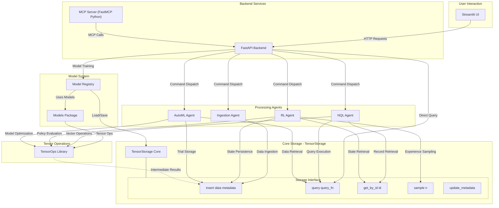

# Tensorus: Agentic Tensor Database/Data Lake

Tensorus is a specialized data platform focused on the management and agent-driven manipulation of tensor data. It offers a streamlined environment for storing, retrieving, and operating on tensors, laying the groundwork for advanced AI and machine learning workflows.

The core purpose of Tensorus is to simplify and enhance how developers and AI agents interact with tensor datasets. By providing dedicated tools for tensor operations and a framework for agentic integration, Tensorus aims to accelerate tasks like automated data ingestion, reinforcement learning from stored experiences, and AutoML processes, ultimately enabling more efficient and intelligent data utilization in AI projects.

## Key Features

*   **Tensor Storage:** Efficiently store and retrieve PyTorch tensors with associated metadata.
*   **Dataset Schemas:** Optional per-dataset schemas enforce required metadata fields and tensor shape/dtype.
*   **Natural Query Language (NQL):** Query your tensor data using a simple, natural language-like syntax.
*   **Agent Framework:** A foundation for building and integrating intelligent agents that interact with your data.
    *   **Data Ingestion Agent:** Automatically monitors a directory for new files and ingests them as tensors.
    *   **RL Agent:** A Deep Q-Network (DQN) agent that can learn from experiences stored in TensorStorage.
    *   **AutoML Agent:** Performs hyperparameter optimization for a dummy model using random search.
*   **API-Driven:** A FastAPI backend provides a RESTful API for interacting with Tensorus.
*   **Streamlit UI:** A user-friendly Streamlit frontend for exploring data and controlling agents.
*   **Tensor Operations:** A comprehensive library of robust tensor operations for common manipulations. See [Basic Tensor Operations](#basic-tensor-operations) for details.
*   **Model System:** Optional model registry with example models provided in a
    separate package. See [Tensorus Models](https://github.com/tensorus/models).
*   **Metadata System:** Rich Pydantic schemas and storage backends for semantic, lineage, computational, quality, relational, and usage metadata.
*   **Extensible:** Designed to be extended with more advanced agents, storage backends, and query capabilities.
*   **Model Context Protocol (MCP) Server:** Provides a standardized interface for AI agents and LLMs to interact with Tensorus capabilities—including dataset management, tensor storage, and operations—using the Model Context Protocol. (See [MCP Server Details](#mcp-server-details) below).

## Project Structure

*   `app.py`: The main Streamlit frontend application (located at the project root).
*   `pages/`: Directory containing individual Streamlit page scripts and shared UI utilities for the dashboard.
    *   `pages/ui_utils.py`: Utility functions specifically for the Streamlit UI.
    *   *(Other page scripts like `01_dashboard.py`, `02_control_panel.py`, etc., define the different views of the dashboard)*
*   `tensorus/`: Directory containing the core `tensorus` library modules (this is the main installable package).
    *   `tensorus/__init__.py`: Makes `tensorus` a Python package.
    *   `tensorus/api.py`: The FastAPI application providing the backend API for Tensorus.
    *   `tensorus/tensor_storage.py`: Core TensorStorage implementation for managing tensor data.
    *   `tensorus/tensor_ops.py`: Library of functions for tensor manipulations.
    *   `tensorus/nql_agent.py`: Agent for processing Natural Query Language queries.
    *   `tensorus/ingestion_agent.py`: Agent for ingesting data from various sources.
    *   `tensorus/rl_agent.py`: Agent for Reinforcement Learning tasks.
    *   `tensorus/automl_agent.py`: Agent for AutoML processes.
    *   `tensorus/dummy_env.py`: A simple environment for the RL agent demonstration.
    *   *(Other Python files within `tensorus/` are part of the core library.)*
*   `requirements.txt`: Lists the project's Python dependencies for development and local execution.
*   `pyproject.toml`: Project metadata, dependencies for distribution, and build system configuration (e.g., for PyPI).
*   `tensorus/mcp_server.py`: Python implementation of the Model Context Protocol (MCP) server using `fastmcp`.
*   `README.md`: This file.
*   `LICENSE`: Project license file.
*   `.gitignore`: Specifies intentionally untracked files that Git should ignore.

## Huggingface Demo

You can try Tensorus online via Huggingface Spaces:

*   **API Documentation:** [Swagger UI](https://tensorus-api.hf.space/docs) | [ReDoc](https://tensorus-api.hf.space/redoc)
*   **Dashboard UI:** [Streamlit Dashboard](https://tensorus-dashboard.hf.space)

## Tensorus Execution Cycle



## Getting Started

### Prerequisites

*   Python 3.10+
*   PyTorch
*   FastAPI
*   Uvicorn
*   Streamlit
*   Pydantic v2
*   Requests
*   Pillow (for image preprocessing)
*   Matplotlib (optional, for plotting RL rewards)

### Installation

1.  Clone the repository:

    ```bash
    git clone https://github.com/tensorus/tensorus.git
    cd tensorus
    ```

2.  Create a virtual environment (recommended):

    ```bash
    python3 -m venv venv
    source venv/bin/activate  # On Linux/macOS
    venv\Scripts\activate  # On Windows
    ```

3.  Install dependencies using the provided setup script:

    ```bash
    ./setup.sh
    ```
    This installs Python requirements from `requirements.txt` and
    `requirements-test.txt`, using CPU wheels for PyTorch and
    pinning `httpx` to a compatible version. The test requirements
    also install `fastapi>=0.110` for compatibility with Pydantic v2.
    The script also installs test requirements for running the Python test suite.
    Heavy machine-learning libraries (e.g. `xgboost`, `lightgbm`, `catboost`,
    `statsmodels`, `torch-geometric`) are not installed by default. Install
    them separately using `pip install tensorus[models]` or by installing the
    `tensorus-models` package if you need the built-in models.
    The audit logger writes to `tensorus_audit.log` by default. Override the
    path with the `TENSORUS_AUDIT_LOG_PATH` environment variable if desired.

### Running the API Server

1.  Navigate to the project root directory (the directory containing the `tensorus` folder and `pyproject.toml`).
2.  Ensure your virtual environment is activated if you are using one.
3.  Start the FastAPI backend server using:

    ```bash
    uvicorn tensorus.api:app --host 0.0.0.0 --port 7860
    ```

    *   This command launches Uvicorn with the `app` instance defined in `tensorus/api.py`.
    *   Access the API documentation at `http://localhost:7860/docs` or `http://localhost:7860/redoc`.
    *   All dataset and agent endpoints are available once the server is running.

### Running the Streamlit UI

1.  In a separate terminal (with the virtual environment activated), navigate to the project root.
2.  Start the Streamlit frontend:

    ```bash
    streamlit run app.py
    ```

    *   Access the UI in your browser at the URL provided by Streamlit (usually `http://localhost:8501`).

### Running the MCP Server

Tensorus provides a lightweight Python implementation of the Model Context Protocol server using `fastmcp`. It exposes the FastAPI endpoints as tools so you can run an MCP server without Node.js.

**Starting the MCP Server:**

1. Install dependencies (includes `fastmcp`):
   ```bash
   pip install -r requirements.txt
   ```
2. Ensure the FastAPI backend is running.
3. Start the server from the repository root:
   ```bash
   python -m tensorus.mcp_server
   ```
   Add `--transport sse` to use SSE transport.
   If you plan to run the MCP server tests in `tests/test_mcp_server.py` and `tests/test_mcp_client.py`, run `./setup.sh` beforehand to install all required packages.


### Running the Agents (Examples)

You can run the example agents directly from their respective files:

*   **RL Agent:**

    ```bash
    python tensorus/rl_agent.py
    ```

*   **AutoML Agent:**

    ```bash
    python tensorus/automl_agent.py
    ```

*   **Ingestion Agent:**

    ```bash
    python tensorus/ingestion_agent.py
    ```

    *   Note: The Ingestion Agent will monitor the `temp_ingestion_source` directory (created automatically if it doesn't exist in the project root) for new files.

### Docker Usage

Tensorus can also be run inside a Docker container. Build the image from the project root:

```bash
docker build -t tensorus .
```

Run the container and expose the API server on port `7860`:

```bash
docker run -p 7860:7860 tensorus
```

The FastAPI documentation will then be available at `http://localhost:7860/docs`.

If your system has NVIDIA GPUs and the [NVIDIA Container Toolkit](https://github.com/NVIDIA/nvidia-docker) installed, you can pass `--gpus all` to `docker run` and modify `setup.sh` to install CUDA-enabled PyTorch wheels for GPU acceleration.

### Deployment

Tensorus adds several security headers by default. You can customize them with environment variables:

* `TENSORUS_X_FRAME_OPTIONS` – value for the `X-Frame-Options` header (default `SAMEORIGIN`).
* `TENSORUS_CONTENT_SECURITY_POLICY` – value for the `Content-Security-Policy` header (default `default-src 'self'`).

If either variable is empty or set to `NONE`, the corresponding header is omitted.
The default policy prevents ReDoc from loading its CDN assets. See [ReDoc and Content Security Policy](docs/api_guide.md#re-doc-and-content-security-policy) for an example policy that allows them.

Example configuration:

```bash
# Allow embedding from a trusted site
TENSORUS_X_FRAME_OPTIONS="ALLOW-FROM https://example.com"

# Permit scripts from an external CDN
TENSORUS_CONTENT_SECURITY_POLICY="default-src 'self'; script-src 'self' https://cdn.example.com"
```

### Test Suite Dependencies

The Python tests rely on packages from both `requirements.txt` and
`requirements-test.txt`. Make sure these dependencies are installed
before running `pytest` by executing the provided setup script:

```bash
./setup.sh
```

### Running Tests

Tensorus includes Python unit tests. To set up the environment and run them:

1. Install all dependencies using:

    ```bash
    ./setup.sh
    ```

    This script installs packages from `requirements.txt` and `requirements-test.txt` (which pins `fastapi>=0.110` for Pydantic v2 support). It also pulls in `fastmcp` and other dependencies required by `tests/test_mcp_server.py` and `tests/test_mcp_client.py`.

2. Run the Python test suite:

    ```bash
    pytest
    ```

    To specifically verify the Model Context Protocol components, run the MCP
    server and client tests:

    ```bash
    pytest tests/test_mcp_server.py tests/test_mcp_client.py
    ```


## Using Tensorus

### API Endpoints

The API provides the following main endpoints:

*   **Datasets:**
    *   `POST /datasets/create`: Create a new dataset.
    *   `POST /datasets/{name}/ingest`: Ingest a tensor into a dataset.
    *   `GET /datasets/{name}/fetch`: Retrieve all records from a dataset.
    *   `GET /datasets/{name}/records`: Retrieve a page of records. Supports `offset` (start index, default `0`) and `limit` (max results, default `100`).
    *   `GET /datasets`: List all available datasets.
*   **Querying:**
    *   `POST /query`: Execute an NQL query.
*   **Agents:**
    *   `GET /agents`: List all registered agents.
    *   `GET /agents/{agent_id}/status`: Get the status of a specific agent.
    *   `POST /agents/{agent_id}/start`: Start an agent.
    *   `POST /agents/{agent_id}/stop`: Stop an agent.
    *   `GET /agents/{agent_id}/logs`: Get recent logs for an agent.
*   **Metrics & Monitoring:**
    *   `GET /metrics/dashboard`: Get aggregated dashboard metrics.

### Dataset Schemas

Datasets can optionally include a schema when created. The schema defines
required metadata fields and expected tensor `shape` and `dtype`. Inserts that
violate the schema will raise a validation error.

Example:

```python
schema = {
    "shape": [3, 10],
    "dtype": "float32",
    "metadata": {"source": "str", "value": "int"}
}
storage.create_dataset("my_ds", schema=schema)
storage.insert("my_ds", torch.rand(3, 10), {"source": "sensor", "value": 5})
```

## Metadata System

Tensorus includes a detailed metadata subsystem for describing tensors beyond their raw data. Each tensor has a `TensorDescriptor` and can be associated with optional semantic, lineage, computational, quality, relational, and usage metadata. The metadata storage backend is pluggable, supporting in-memory storage for quick testing or PostgreSQL for persistence. Search and aggregation utilities allow querying across these metadata fields. See [metadata_schemas.md](docs/metadata_schemas.md) for schema details.

### Streamlit UI


The Streamlit UI provides a user-friendly interface for:

*   **Dashboard:** View basic system metrics and agent status.
*   **Agent Control:** Start, stop, and view logs for agents.
*   **NQL Chat:** Enter natural language queries and view results.
*   **Data Explorer:** Browse datasets, preview data, and perform tensor operations.

## Natural Query Language (NQL)

Tensorus ships with a simple regex‑based Natural Query Language for retrieving
tensors by metadata. You can issue NQL queries via the API or from the "NQL
Chat" page in the Streamlit UI.

### Enabling LLM rewriting

Set `NQL_USE_LLM=true` before starting the API server or Streamlit UI to enable
experimental LLM rewriting of natural language queries. Optionally specify a
model with `NQL_LLM_MODEL=<model-name>` (e.g., `google/flan-t5-base`). This
feature relies on the heavy `transformers` dependency and may trigger a model
download the first time it runs, which can take some time.

## Agent Details

### Data Ingestion Agent

*   **Functionality:** Monitors a source directory for new files, preprocesses them into tensors, and inserts them into TensorStorage.
*   **Supported File Types:** CSV, PNG, JPG, JPEG, TIF, TIFF (can be extended).
*   **Preprocessing:** Uses default functions for CSV and images (resize, normalize).
*   **Configuration:**
    *   `source_directory`: The directory to monitor.
    *   `polling_interval_sec`: How often to check for new files.
    *   `preprocessing_rules`: A dictionary mapping file extensions to custom preprocessing functions.

### RL Agent

*   **Functionality:** A Deep Q-Network (DQN) agent that learns from experiences stored in TensorStorage.
*   **Environment:** Uses a `DummyEnv` for demonstration.
*   **Experience Storage:** Stores experiences (state, action, reward, next_state, done) in TensorStorage.
*   **Training:** Implements epsilon-greedy exploration and target network updates.
*   **Configuration:**
    *   `state_dim`: Dimensionality of the environment state.
    *   `action_dim`: Number of discrete actions.
    *   `hidden_size`: Hidden layer size for the DQN.
    *   `lr`: Learning rate.
    *   `gamma`: Discount factor.
    *   `epsilon_*`: Epsilon-greedy parameters.
    *   `target_update_freq`: Target network update frequency.
    *   `batch_size`: Experience batch size.
    *   `experience_dataset`: Dataset name for experiences.
    *   `state_dataset`: Dataset name for state tensors.

### AutoML Agent

*   **Functionality:** Performs hyperparameter optimization using random search.
*   **Model:** Trains a simple `DummyMLP` model.
*   **Search Space:** Configurable hyperparameter search space (learning rate, hidden size, activation).
*   **Evaluation:** Trains and evaluates models on synthetic data.
*   **Results:** Stores trial results (parameters, score) in TensorStorage.
*   **Configuration:**
    *   `search_space`: Dictionary defining the hyperparameter search space.
    *   `input_dim`: Input dimension for the model.
    *   `output_dim`: Output dimension for the model.
    *   `task_type`: Type of task ('regression' or 'classification').
    *   `results_dataset`: Dataset name for storing results.


### Tensorus Models

The collection of example models previously bundled with Tensorus now lives in
a separate repository: [tensorus/models](https://github.com/tensorus/models).
Install it with:

```bash
pip install tensorus-models
```

When the package is installed, Tensorus will automatically import it. Set the
environment variable `TENSORUS_MINIMAL_IMPORT=1` before importing Tensorus to
skip this optional dependency and keep startup lightweight.

## Basic Tensor Operations

This section details the core tensor manipulation functionalities provided by `tensor_ops.py`. These operations are designed to be robust, with built-in type and shape checking where appropriate.

#### Arithmetic Operations

*   `add(t1, t2)`: Element-wise addition of two tensors, or a tensor and a scalar.
*   `subtract(t1, t2)`: Element-wise subtraction of two tensors, or a tensor and a scalar.
*   `multiply(t1, t2)`: Element-wise multiplication of two tensors, or a tensor and a scalar.
*   `divide(t1, t2)`: Element-wise division of two tensors, or a tensor and a scalar. Includes checks for division by zero.
*   `power(t1, t2)`: Raises each element in `t1` to the power of `t2`. Supports tensor or scalar exponents.
*   `log(tensor)`: Element-wise natural logarithm with warnings for non-positive values.

#### Matrix and Dot Operations

*   `matmul(t1, t2)`: Matrix multiplication of two tensors, supporting various dimensionalities (e.g., 2D matrices, batched matrix multiplication).
*   `dot(t1, t2)`: Computes the dot product of two 1D tensors.
*   `outer(t1, t2)`: Computes the outer product of two 1‑D tensors.
*   `cross(t1, t2, dim=-1)`: Computes the cross product along the specified dimension (size must be 3).
*   `matrix_eigendecomposition(matrix_A)`: Returns eigenvalues and eigenvectors of a square matrix.
*   `matrix_trace(matrix_A)`: Computes the trace of a 2-D matrix.
*   `tensor_trace(tensor_A, axis1=0, axis2=1)`: Trace of a tensor along two axes.
*   `svd(matrix)`: Singular value decomposition of a matrix, returns `U`, `S`, and `Vh`.
*   `qr_decomposition(matrix)`: QR decomposition returning `Q` and `R`.
*   `lu_decomposition(matrix)`: LU decomposition returning permutation `P`, lower `L`, and upper `U` matrices.
*   `cholesky_decomposition(matrix)`: Cholesky factor of a symmetric positive-definite matrix.
*   `matrix_inverse(matrix)`: Inverse of a square matrix.
*   `matrix_determinant(matrix)`: Determinant of a square matrix.
*   `matrix_rank(matrix)`: Rank of a matrix.

#### Reduction Operations

*   `sum(tensor, dim=None, keepdim=False)`: Computes the sum of tensor elements over specified dimensions.
*   `mean(tensor, dim=None, keepdim=False)`: Computes the mean of tensor elements over specified dimensions. Tensor is cast to float for calculation.
*   `min(tensor, dim=None, keepdim=False)`: Finds the minimum value in a tensor, optionally along a dimension. Returns values and indices if `dim` is specified.
*   `max(tensor, dim=None, keepdim=False)`: Finds the maximum value in a tensor, optionally along a dimension. Returns values and indices if `dim` is specified.
*   `variance(tensor, dim=None, unbiased=False, keepdim=False)`: Variance of tensor elements.
*   `covariance(matrix_X, matrix_Y=None, rowvar=True, bias=False, ddof=None)`: Covariance matrix estimation.
*   `correlation(matrix_X, matrix_Y=None, rowvar=True)`: Correlation coefficient matrix.

#### Reshaping and Slicing

*   `reshape(tensor, shape)`: Changes the shape of a tensor without changing its data.
*   `transpose(tensor, dim0, dim1)`: Swaps two dimensions of a tensor.
*   `permute(tensor, dims)`: Permutes the dimensions of a tensor according to the specified order.
*   `flatten(tensor, start_dim=0, end_dim=-1)`: Flattens a range of dimensions into a single dimension.
*   `squeeze(tensor, dim=None)`: Removes dimensions of size 1, or a specific dimension if provided.
*   `unsqueeze(tensor, dim)`: Inserts a dimension of size 1 at the given position.

#### Concatenation and Splitting

*   `concatenate(tensors, dim=0)`: Joins a sequence of tensors along an existing dimension.
*   `stack(tensors, dim=0)`: Joins a sequence of tensors along a new dimension.

#### Advanced Operations

*   `einsum(equation, *tensors)`: Applies Einstein summation convention to the input tensors based on the provided equation string.
*   `compute_gradient(func, tensor)`: Returns the gradient of a scalar `func` with respect to `tensor`.
*   `compute_jacobian(func, tensor)`: Computes the Jacobian matrix of a vector function.
*   `convolve_1d(signal_x, kernel_w, mode='valid')`: 1‑D convolution using `torch.nn.functional.conv1d`.
*   `convolve_2d(image_I, kernel_K, mode='valid')`: 2‑D convolution using `torch.nn.functional.conv2d`.
 *   `frobenius_norm(tensor)`: Calculates the Frobenius norm.
 *   `l1_norm(tensor)`: Calculates the L1 norm (sum of absolute values).

## Tensor Decomposition Operations

Tensorus includes a library of higher‑order tensor factorizations in
`tensor_decompositions.py`. These operations mirror the algorithms
available in TensorLy and related libraries.

* **CP Decomposition** – Canonical Polyadic factorization returning
  weights and factor matrices.
* **NTF‑CP Decomposition** – Non‑negative CP using
  `non_negative_parafac`.
* **Tucker Decomposition** – Standard Tucker factorization for specified
  ranks.
* **Non‑negative Tucker / Partial Tucker** – Variants with HOOI and
  non‑negative constraints.
* **HOSVD** – Higher‑order SVD (Tucker with full ranks).
* **Tensor Train (TT)** – Sequence of TT cores representing the tensor.
* **TT‑SVD** – TT factorization via SVD initialization.
* **Tensor Ring (TR)** – Circular variant of TT.
* **Hierarchical Tucker (HT)** – Decomposition using a dimension tree.
* **Block Term Decomposition (BTD)** – Sum of Tucker‑1 terms for 3‑way
  tensors.
* **t‑SVD** – Tensor singular value decomposition based on the
  t‑product.

Examples of how to call these methods are provided in
[`tensorus/tensor_decompositions.py`](tensorus/tensor_decompositions.py).

## MCP Server Details

The Tensorus Model Context Protocol (MCP) Server allows external AI agents, LLM-based applications, and other MCP-compatible clients to interact with Tensorus functionalities in a standardized way. It acts as a bridge, translating MCP requests into calls to the Tensorus Python API.

### Overview

*   **Protocol:** Implements the [Model Context Protocol](https://modelcontextprotocol.io/introduction).
*   **Language:** Python, using the `fastmcp` library.
*   **Communication:** Typically uses stdio for communication with a single client.
*   **Interface:** Exposes Tensorus capabilities as a set of "tools" that an MCP client can list and call.

### Available Tools

The MCP server provides tools for various Tensorus functionalities. Below is an overview. For detailed input schemas and descriptions, an MCP client can call the standard `tools/list` method on the server, or you can inspect the tool definitions in `tensorus/mcp_server.py`.

*   **Dataset Management:**
    *   `tensorus_list_datasets`: Lists all available datasets.
    *   `tensorus_create_dataset`: Creates a new dataset.
    *   `tensorus_delete_dataset`: Deletes an existing dataset.
*   **Tensor Management:**
    *   `tensorus_ingest_tensor`: Ingests a new tensor (with data provided as JSON) into a dataset.
    *   `tensorus_get_tensor_details`: Retrieves the data and metadata for a specific tensor.
    *   `tensorus_delete_tensor`: Deletes a specific tensor from a dataset.
    *   `tensorus_update_tensor_metadata`: Updates the metadata of a specific tensor.
*   **Tensor Operations:** These tools allow applying operations from the `TensorOps` library to tensors stored in Tensorus.
    *   `tensorus_apply_unary_operation`: Applies operations like `log`, `reshape`, `transpose`, `permute`, `sum`, `mean`, `min`, `max`.
    *   `tensorus_apply_binary_operation`: Applies operations like `add`, `subtract`, `multiply`, `divide`, `power`, `matmul`, `dot`.
    *   `tensorus_apply_list_operation`: Applies operations like `concatenate` and `stack` that take a list of input tensors.
    *   `tensorus_apply_einsum`: Applies Einstein summation.

*Note on Tensor Operations via MCP:* Input tensors are referenced by their `dataset_name` and `record_id`. The result is typically stored as a new tensor, and the MCP tool returns details of this new result tensor (like its `record_id`).

### Example Client Interaction (Conceptual)

```javascript
// Conceptual MCP client-side JavaScript
// Assuming 'client' is an initialized MCP client connected to the Tensorus MCP Server

async function example() {
  // List available tools
  const { tools } = await client.request({ method: 'tools/list' }, {});
  console.log("Available Tensorus Tools:", tools.map(t => t.name)); // Log only names for brevity

  // Create a new dataset
  const createResponse = await client.request({ method: 'tools/call' }, {
    name: 'tensorus_create_dataset',
    arguments: { dataset_name: 'my_mcp_dataset' }
  });
  console.log(JSON.parse(createResponse.content[0].text).message);

  // Ingest a tensor
  const ingestResponse = await client.request({ method: 'tools/call' }, {
    name: 'tensorus_ingest_tensor',
    arguments: {
      dataset_name: 'my_mcp_dataset',
      tensor_shape: [2, 2],
      tensor_dtype: 'float32',
      tensor_data: [[1.0, 2.0], [3.0, 4.0]],
      metadata: { source: 'mcp_client_example' }
    }
  });
  // Assuming the Python API returns { success, message, data: { record_id, ... } }
  // And MCP server stringifies this whole object in the text content
  const ingestData = JSON.parse(ingestResponse.content[0].text);
  console.log("Ingest success:", ingestData.success, "Record ID:", ingestData.data.record_id);
}
```

You can also interact with the server using the included Python helper:

```python
from tensorus.mcp_client import TensorusMCPClient

async def example_py():
    async with TensorusMCPClient("http://localhost:7860/sse") as client:
        tools = await client.list_datasets()
        print(tools)
```

## Completed Features

*   **Tensor Storage:** Efficiently stores and retrieves PyTorch tensors with associated metadata, including in-memory and optional file-based persistence. Supports dataset creation, tensor ingestion, querying, sampling, and metadata updates.
*   **Natural Query Language (NQL):** Provides a basic regex-based natural language interface for querying tensor data, supporting retrieval and simple filtering.
*   **Agent Framework:** Includes several operational agents:
    *   **Data Ingestion Agent:** Monitors local directories for CSV and image files, preprocesses them, and ingests them into TensorStorage.
    *   **RL Agent:** Implements a DQN agent that learns from experiences (stored in TensorStorage) in a dummy environment.
    *   **AutoML Agent:** Performs random search hyperparameter optimization for a dummy MLP model, storing trial results in TensorStorage.
*   **API-Driven:** A comprehensive FastAPI backend offers RESTful endpoints for dataset management, NQL querying, tensor operations, and agent control (live for Ingestion Agent, simulated for RL/AutoML).
*   **Streamlit UI:** A multi-page user interface for dashboard overview, agent control, NQL interaction, data exploration, and API interaction.
*   **Tensor Operations:** A library of robust tensor operations (arithmetic, matrix ops, reductions, reshaping, etc.) accessible via the API.
*   **Model Context Protocol (MCP) Server:** A Python server built with `fastmcp` exposes Tensorus capabilities (storage and operations) via the Model Context Protocol.
*   **Extensible Design:** The project is structured with modular components, facilitating future extensions.

## Future Implementation

*   **Enhanced NQL:** Integrate a local or remote LLM for more robust natural language understanding.
*   **Advanced Agents:** Develop more sophisticated agents for specific tasks (e.g., anomaly detection, forecasting).
*   **Persistent Storage Backend:** Replace/augment current file-based persistence with more robust database or cloud storage solutions (e.g., PostgreSQL, S3, MinIO).
*   **Scalability & Performance:**
    *   Implement tensor chunking for very large tensors.
    *   Optimize query performance with indexing.
    *   Asynchronous operations for agents and API calls.
*   **Security:** Implement authentication and authorization mechanisms for the API and UI.
*   **Real-World Integration:**
    *   Connect Ingestion Agent to more data sources (e.g., cloud storage, databases, APIs).
    *   Integrate RL Agent with real-world environments or more complex simulations.
*   **Advanced AutoML:**
    *   Implement sophisticated search algorithms (e.g., Bayesian Optimization, Hyperband).
    *   Support for diverse model architectures and custom models.
*   **Model Management:** Add capabilities for saving, loading, versioning, and deploying trained models (from RL/AutoML).
*   **Streaming Data Support:** Enhance Ingestion Agent to handle real-time streaming data.
*   **Resource Management:** Add tools and controls for monitoring and managing the resource consumption (CPU, memory) of agents.
*   **Improved UI/UX:** Continuously refine the Streamlit UI for better usability and richer visualizations.
*   **Comprehensive Testing:** Expand unit, integration, and end-to-end tests.

## Contributing

Contributions are welcome! Please feel free to open issues or submit pull requests.

## License

MIT License
