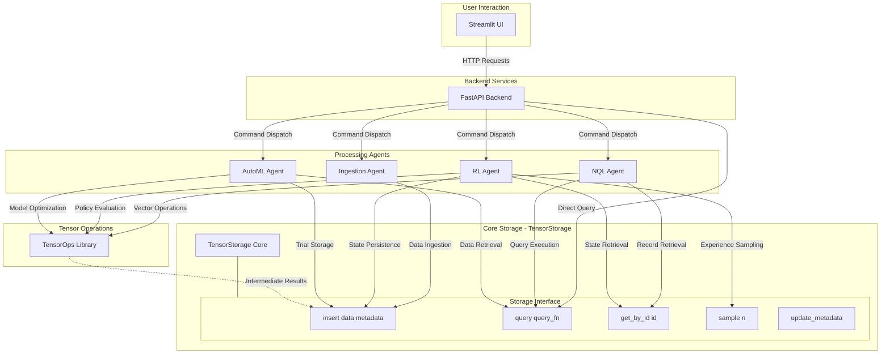

# Tensorus: Agentic Tensor Database/Data Lake

Tensorus is a specialized data platform focused on the management and agent-driven manipulation of tensor data. It offers a streamlined environment for storing, retrieving, and operating on tensors, laying the groundwork for advanced AI and machine learning workflows.

The core purpose of Tensorus is to simplify and enhance how developers and AI agents interact with tensor datasets. By providing dedicated tools for tensor operations and a framework for agentic integration, Tensorus aims to accelerate tasks like automated data ingestion, reinforcement learning from stored experiences, and AutoML processes, ultimately enabling more efficient and intelligent data utilization in AI projects.

## Key Features

*   **Tensor Storage:** Efficiently store and retrieve PyTorch tensors with associated metadata.
*   **Natural Query Language (NQL):** Query your tensor data using a simple, natural language-like syntax.
*   **Agent Framework:** A foundation for building and integrating intelligent agents that interact with your data.
    *   **Data Ingestion Agent:** Automatically monitors a directory for new files and ingests them as tensors.
    *   **RL Agent:** A Deep Q-Network (DQN) agent that can learn from experiences stored in TensorStorage.
    *   **AutoML Agent:** Performs hyperparameter optimization for a dummy model using random search.
*   **API-Driven:** A FastAPI backend provides a RESTful API for interacting with Tensorus.
*   **Streamlit UI:** A user-friendly Streamlit frontend for exploring data and controlling agents.
*   **Tensor Operations:** A comprehensive library of robust tensor operations for common manipulations. See [Basic Tensor Operations](#basic-tensor-operations) for details.
*   **Extensible:** Designed to be extended with more advanced agents, storage backends, and query capabilities.
*   **Model Context Protocol (MCP) Server:** Provides a standardized interface for AI agents and LLMs to interact with Tensorus capabilities (tensor storage and operations) using the Model Context Protocol. (See [MCP Server Details](#mcp-server-details) below).

## Project Structure

*   `api.py`: The FastAPI application that serves as the backend API.
*   `app.py`: The Streamlit frontend application.
*   `tensor_storage.py`: The core TensorStorage implementation.
*   `nql_agent.py`: The Natural Query Language (NQL) agent.
*   `ingestion_agent.py`: The Data Ingestion agent.
*   `rl_agent.py`: The Reinforcement Learning (DQN) agent.
*   `automl_agent.py`: The AutoML agent.
*   `tensor_ops.py`: A library of tensor operations.
*   `dummy_env.py`: A simple environment for the RL agent.
*   `ui_utils.py`: Utility functions for the Streamlit UI.
*   `requirements.txt`: Lists the project's dependencies.
*   `mcp_tensorus_server/`: Contains the Node.js application for the Model Context Protocol (MCP) server.
    *   `mcp_tensorus_server/server.js`: The main MCP server implementation.
    *   `mcp_tensorus_server/package.json`: Node.js project file and dependencies for the MCP server.

## Huggingface Demo

You can try Tensorus online via Huggingface Spaces:

*   **API Documentation:** [Swagger UI](https://tensorus-api.hf.space/docs) | [ReDoc](https://tensorus-api.hf.space/redoc)
*   **Dashboard UI:** [Streamlit Dashboard](https://tensorus-dashboard.hf.space)

## Tensorus Execution Cycle



## Getting Started

### Prerequisites

*   Python 3.9+
*   PyTorch
*   FastAPI
*   Uvicorn
*   Streamlit
*   Pydantic
*   Requests
*   Pillow (for image preprocessing)
*   Matplotlib (optional, for plotting RL rewards)

### Installation

1.  Clone the repository:

    ```bash
    git clone https://github.com/tensorus/tensorus.git
    cd tensorus
    ```

2.  Create a virtual environment (recommended):

    ```bash
    python3 -m venv venv
    source venv/bin/activate  # On Linux/macOS
    venv\Scripts\activate  # On Windows
    ```

3.  Install dependencies:

    ```bash
    pip install -r requirements.txt
    ```

### Running the API

1.  Navigate to the project root directory.
2.  Start the FastAPI backend:

    ```bash
    uvicorn api:app --reload --host 127.0.0.1 --port 8000
    ```

    *   Access the API documentation at `http://127.0.0.1:8000/docs` or `http://127.0.0.1:8000/redoc`.

### Running the Streamlit UI

1.  In a separate terminal (with the virtual environment activated), navigate to the project root.
2.  Start the Streamlit frontend:

    ```bash
    streamlit run app.py
    ```

    *   Access the UI in your browser at the URL provided by Streamlit (usually `http://localhost:8501`).

### Running the MCP Server

The Tensorus MCP Server is a Node.js application that acts as a bridge to the Python backend, exposing Tensorus capabilities as "tools" via the Model Context Protocol.

**Prerequisites (MCP Server):**

*   Node.js (v16 or later recommended) and npm.
*   The Python FastAPI backend (`api.py`) must be running (see [Running the API](#running-the-api)).

**Setup & Installation (MCP Server):**

1.  Navigate to the MCP server directory:
    ```bash
    cd mcp_tensorus_server
    ```
2.  Install Node.js dependencies:
    ```bash
    npm install
    ```

**Starting the MCP Server:**

1.  Ensure the Python FastAPI backend is running.
2.  From the `mcp_tensorus_server` directory, run:
    ```bash
    node server.js
    ```
    Or, if a start script is added to `mcp_tensorus_server/package.json` (e.g., `"start": "node server.js"`):
    ```bash
    npm start
    ```
3.  The MCP server will connect via stdio by default. MCP clients will communicate with this server process through its standard input and output.

### Running the Agents (Examples)

You can run the example agents directly from their respective files:

*   **RL Agent:**

    ```bash
    python rl_agent.py
    ```

*   **AutoML Agent:**

    ```bash
    python automl_agent.py
    ```

*   **Ingestion Agent:**

    ```bash
    python ingestion_agent.py
    ```

    *   Note: The Ingestion Agent will monitor the `temp_ingestion_source` directory (created automatically) for new files.

## Using Tensorus

### API Endpoints

The API provides the following main endpoints:

*   **Datasets:**
    *   `POST /datasets/create`: Create a new dataset.
    *   `POST /datasets/{name}/ingest`: Ingest a tensor into a dataset.
    *   `GET /datasets/{name}/fetch`: Retrieve all records from a dataset.
    *   `GET /datasets`: List all available datasets.
*   **Querying:**
    *   `POST /query`: Execute an NQL query.
*   **Agents:**
    *   `GET /agents`: List all registered agents.
    *   `GET /agents/{agent_id}/status`: Get the status of a specific agent.
    *   `POST /agents/{agent_id}/start`: Start an agent.
    *   `POST /agents/{agent_id}/stop`: Stop an agent.
    *   `GET /agents/{agent_id}/logs`: Get recent logs for an agent.
*   **Metrics & Monitoring:**
    *   `GET /metrics/dashboard`: Get aggregated dashboard metrics.

### Streamlit UI

The Streamlit UI provides a user-friendly interface for:

*   **Dashboard:** View basic system metrics and agent status.
*   **Agent Control:** Start, stop, and view logs for agents.
*   **NQL Chat:** Enter natural language queries and view results.
*   **Data Explorer:** Browse datasets, preview data, and perform tensor operations.

## Agent Details

### Data Ingestion Agent

*   **Functionality:** Monitors a source directory for new files, preprocesses them into tensors, and inserts them into TensorStorage.
*   **Supported File Types:** CSV, PNG, JPG, JPEG, TIF, TIFF (can be extended).
*   **Preprocessing:** Uses default functions for CSV and images (resize, normalize).
*   **Configuration:**
    *   `source_directory`: The directory to monitor.
    *   `polling_interval_sec`: How often to check for new files.
    *   `preprocessing_rules`: A dictionary mapping file extensions to custom preprocessing functions.

### RL Agent

*   **Functionality:** A Deep Q-Network (DQN) agent that learns from experiences stored in TensorStorage.
*   **Environment:** Uses a `DummyEnv` for demonstration.
*   **Experience Storage:** Stores experiences (state, action, reward, next_state, done) in TensorStorage.
*   **Training:** Implements epsilon-greedy exploration and target network updates.
*   **Configuration:**
    *   `state_dim`: Dimensionality of the environment state.
    *   `action_dim`: Number of discrete actions.
    *   `hidden_size`: Hidden layer size for the DQN.
    *   `lr`: Learning rate.
    *   `gamma`: Discount factor.
    *   `epsilon_*`: Epsilon-greedy parameters.
    *   `target_update_freq`: Target network update frequency.
    *   `batch_size`: Experience batch size.
    *   `experience_dataset`: Dataset name for experiences.
    *   `state_dataset`: Dataset name for state tensors.

### AutoML Agent

*   **Functionality:** Performs hyperparameter optimization using random search.
*   **Model:** Trains a simple `DummyMLP` model.
*   **Search Space:** Configurable hyperparameter search space (learning rate, hidden size, activation).
*   **Evaluation:** Trains and evaluates models on synthetic data.
*   **Results:** Stores trial results (parameters, score) in TensorStorage.
*   **Configuration:**
    *   `search_space`: Dictionary defining the hyperparameter search space.
    *   `input_dim`: Input dimension for the model.
    *   `output_dim`: Output dimension for the model.
    *   `task_type`: Type of task ('regression' or 'classification').
    *   `results_dataset`: Dataset name for storing results.

## Basic Tensor Operations

This section details the core tensor manipulation functionalities provided by `tensor_ops.py`. These operations are designed to be robust, with built-in type and shape checking where appropriate.

#### Arithmetic Operations

*   `add(t1, t2)`: Element-wise addition of two tensors, or a tensor and a scalar.
*   `subtract(t1, t2)`: Element-wise subtraction of two tensors, or a tensor and a scalar.
*   `multiply(t1, t2)`: Element-wise multiplication of two tensors, or a tensor and a scalar.
*   `divide(t1, t2)`: Element-wise division of two tensors, or a tensor and a scalar. Includes checks for division by zero.

#### Matrix and Dot Operations

*   `matmul(t1, t2)`: Matrix multiplication of two tensors, supporting various dimensionalities (e.g., 2D matrices, batched matrix multiplication).
*   `dot(t1, t2)`: Computes the dot product of two 1D tensors.

#### Reduction Operations

*   `sum(tensor, dim=None, keepdim=False)`: Computes the sum of tensor elements over specified dimensions.
*   `mean(tensor, dim=None, keepdim=False)`: Computes the mean of tensor elements over specified dimensions. Tensor is cast to float for calculation.
*   `min(tensor, dim=None, keepdim=False)`: Finds the minimum value in a tensor, optionally along a dimension. Returns values and indices if `dim` is specified.
*   `max(tensor, dim=None, keepdim=False)`: Finds the maximum value in a tensor, optionally along a dimension. Returns values and indices if `dim` is specified.

#### Reshaping and Slicing

*   `reshape(tensor, shape)`: Changes the shape of a tensor without changing its data.
*   `transpose(tensor, dim0, dim1)`: Swaps two dimensions of a tensor.
*   `permute(tensor, dims)`: Permutes the dimensions of a tensor according to the specified order.

#### Concatenation and Splitting

*   `concatenate(tensors, dim=0)`: Joins a sequence of tensors along an existing dimension.
*   `stack(tensors, dim=0)`: Joins a sequence of tensors along a new dimension.

#### Advanced Operations

*   `einsum(equation, *tensors)`: Applies Einstein summation convention to the input tensors based on the provided equation string.

## MCP Server Details

The Tensorus Model Context Protocol (MCP) Server allows external AI agents, LLM-based applications, and other MCP-compatible clients to interact with Tensorus functionalities in a standardized way. It acts as a bridge, translating MCP requests into calls to the Tensorus Python API.

### Overview

*   **Protocol:** Implements the [Model Context Protocol](https://modelcontextprotocol.io/introduction).
*   **Language:** Node.js, using the `@modelcontextprotocol/sdk`.
*   **Communication:** Typically uses stdio for communication with a single client.
*   **Interface:** Exposes Tensorus capabilities as a set of "tools" that an MCP client can list and call.

### Available Tools

The MCP server provides tools for various Tensorus functionalities. Below is an overview. For detailed input schemas and descriptions, an MCP client can call the standard `tools/list` method on the server, or you can inspect the `toolDefinitions` array within `mcp_tensorus_server/server.js`.

*   **Dataset Management:**
    *   `tensorus_list_datasets`: Lists all available datasets.
    *   `tensorus_create_dataset`: Creates a new dataset.
    *   `tensorus_delete_dataset`: Deletes an existing dataset.
*   **Tensor Management:**
    *   `tensorus_ingest_tensor`: Ingests a new tensor (with data provided as JSON) into a dataset.
    *   `tensorus_get_tensor_details`: Retrieves the data and metadata for a specific tensor.
    *   `tensorus_delete_tensor`: Deletes a specific tensor from a dataset.
    *   `tensorus_update_tensor_metadata`: Updates the metadata of a specific tensor.
*   **Tensor Operations:** These tools allow applying operations from the `TensorOps` library to tensors stored in Tensorus.
    *   `tensorus_apply_unary_operation`: Applies operations like `log`, `reshape`, `transpose`, `permute`, `sum`, `mean`, `min`, `max`.
    *   `tensorus_apply_binary_operation`: Applies operations like `add`, `subtract`, `multiply`, `divide`, `power`, `matmul`, `dot`.
    *   `tensorus_apply_list_operation`: Applies operations like `concatenate` and `stack` that take a list of input tensors.
    *   `tensorus_apply_einsum`: Applies Einstein summation.

*Note on Tensor Operations via MCP:* Input tensors are referenced by their `dataset_name` and `record_id`. The result is typically stored as a new tensor, and the MCP tool returns details of this new result tensor (like its `record_id`).

### Example Client Interaction (Conceptual)

```javascript
// Conceptual MCP client-side JavaScript
// Assuming 'client' is an initialized MCP client connected to the Tensorus MCP Server

async function example() {
  // List available tools
  const { tools } = await client.request({ method: 'tools/list' }, {});
  console.log("Available Tensorus Tools:", tools.map(t => t.name)); // Log only names for brevity

  // Create a new dataset
  const createResponse = await client.request({ method: 'tools/call' }, {
    name: 'tensorus_create_dataset',
    arguments: { dataset_name: 'my_mcp_dataset' }
  });
  console.log(JSON.parse(createResponse.content[0].text).message);

  // Ingest a tensor
  const ingestResponse = await client.request({ method: 'tools/call' }, {
    name: 'tensorus_ingest_tensor',
    arguments: {
      dataset_name: 'my_mcp_dataset',
      tensor_shape: [2, 2],
      tensor_dtype: 'float32',
      tensor_data: [[1.0, 2.0], [3.0, 4.0]],
      metadata: { source: 'mcp_client_example' }
    }
  });
  // Assuming the Python API returns { success, message, data: { record_id, ... } }
  // And MCP server stringifies this whole object in the text content
  const ingestData = JSON.parse(ingestResponse.content[0].text);
  console.log("Ingest success:", ingestData.success, "Record ID:", ingestData.data.record_id);
}
```

## Future Work

*   **Enhanced NQL:** Integrate a local or remote LLM for more robust natural language understanding.
*   **Advanced Agents:** Develop more sophisticated agents for specific tasks.
*   **Persistent Storage:** Replace in-memory TensorStorage with a persistent backend (e.g., database, cloud storage).
*   **Scalability:** Implement chunking and other optimizations for handling very large tensors.
*   **Security:** Add authentication and authorization.
*   **Real-World Data:** Integrate with real-world data sources and environments.
*   **Advanced Search:** Implement more advanced hyperparameter search algorithms (Bayesian Optimization, Hyperband).
*   **Model Management:** Add capabilities for saving and loading trained models.
*   **Streaming Data:** Support for streaming data sources.
*   **Schema Validation:** Implement schema validation for datasets.
*   **Resource Management:** Add controls for managing agent resource usage.

## Contributing

Contributions are welcome! Please feel free to open issues or submit pull requests.

## License

MIT License
