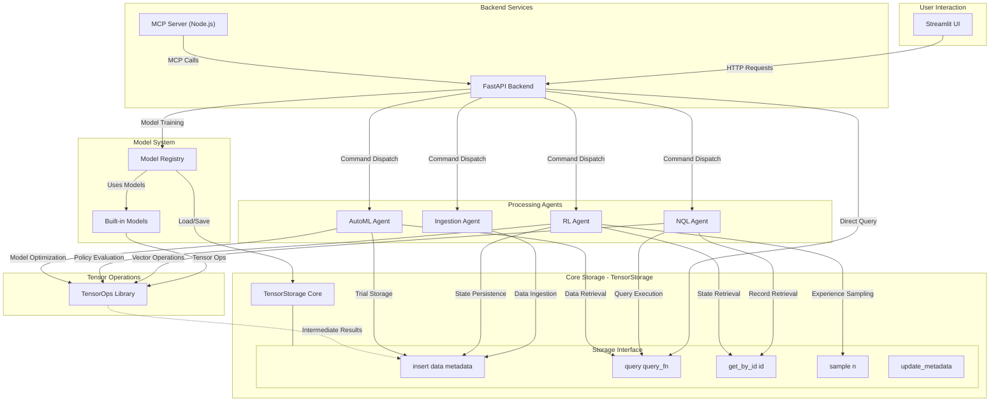

# Tensorus: Agentic Tensor Database/Data Lake

Tensorus is a specialized data platform focused on the management and agent-driven manipulation of tensor data. It offers a streamlined environment for storing, retrieving, and operating on tensors, laying the groundwork for advanced AI and machine learning workflows.

The core purpose of Tensorus is to simplify and enhance how developers and AI agents interact with tensor datasets. By providing dedicated tools for tensor operations and a framework for agentic integration, Tensorus aims to accelerate tasks like automated data ingestion, reinforcement learning from stored experiences, and AutoML processes, ultimately enabling more efficient and intelligent data utilization in AI projects.

## Key Features

*   **Tensor Storage:** Efficiently store and retrieve PyTorch tensors with associated metadata.
*   **Natural Query Language (NQL):** Query your tensor data using a simple, natural language-like syntax.
*   **Agent Framework:** A foundation for building and integrating intelligent agents that interact with your data.
    *   **Data Ingestion Agent:** Automatically monitors a directory for new files and ingests them as tensors.
    *   **RL Agent:** A Deep Q-Network (DQN) agent that can learn from experiences stored in TensorStorage.
    *   **AutoML Agent:** Performs hyperparameter optimization for a dummy model using random search.
*   **API-Driven:** A FastAPI backend provides a RESTful API for interacting with Tensorus.
*   **Streamlit UI:** A user-friendly Streamlit frontend for exploring data and controlling agents.
*   **Tensor Operations:** A comprehensive library of robust tensor operations for common manipulations. See [Basic Tensor Operations](#basic-tensor-operations) for details.
*   **Model System:** Lightweight framework with a model registry and built-in
    linear and logistic regression models.
*   **Extensible:** Designed to be extended with more advanced agents, storage backends, and query capabilities.
*   **Model Context Protocol (MCP) Server:** Provides a standardized interface for AI agents and LLMs to interact with Tensorus capabilities (tensor storage and operations) using the Model Context Protocol. (See [MCP Server Details](#mcp-server-details) below).

## Project Structure

*   `app.py`: The main Streamlit frontend application (located at the project root).
*   `pages/`: Directory containing individual Streamlit page scripts and shared UI utilities for the dashboard.
    *   `pages/ui_utils.py`: Utility functions specifically for the Streamlit UI.
    *   *(Other page scripts like `01_dashboard.py`, `02_control_panel.py`, etc., define the different views of the dashboard)*
*   `tensorus/`: Directory containing the core `tensorus` library modules (this is the main installable package).
    *   `tensorus/__init__.py`: Makes `tensorus` a Python package.
    *   `tensorus/api.py`: The FastAPI application providing the backend API for Tensorus.
    *   `tensorus/tensor_storage.py`: Core TensorStorage implementation for managing tensor data.
    *   `tensorus/tensor_ops.py`: Library of functions for tensor manipulations.
    *   `tensorus/nql_agent.py`: Agent for processing Natural Query Language queries.
    *   `tensorus/ingestion_agent.py`: Agent for ingesting data from various sources.
    *   `tensorus/rl_agent.py`: Agent for Reinforcement Learning tasks.
    *   `tensorus/automl_agent.py`: Agent for AutoML processes.
    *   `tensorus/dummy_env.py`: A simple environment for the RL agent demonstration.
    *   *(Other Python files within `tensorus/` are part of the core library.)*
*   `requirements.txt`: Lists the project's Python dependencies for development and local execution.
*   `pyproject.toml`: Project metadata, dependencies for distribution, and build system configuration (e.g., for PyPI).
*   `mcp_tensorus_server/`: Directory for the Node.js Model Context Protocol (MCP) server.
    *   `mcp_tensorus_server/server.js`: The main MCP server implementation.
    *   `mcp_tensorus_server/package.json`: Node.js project file for the MCP server.
*   `README.md`: This file.
*   `LICENSE`: Project license file.
*   `.gitignore`: Specifies intentionally untracked files that Git should ignore.

## Huggingface Demo

You can try Tensorus online via Huggingface Spaces:

*   **API Documentation:** [Swagger UI](https://tensorus-api.hf.space/docs) | [ReDoc](https://tensorus-api.hf.space/redoc)
*   **Dashboard UI:** [Streamlit Dashboard](https://tensorus-dashboard.hf.space)

## Tensorus Execution Cycle



## Getting Started

### Prerequisites

*   Python 3.9+
*   PyTorch
*   FastAPI
*   Uvicorn
*   Streamlit
*   Pydantic
*   Requests
*   Pillow (for image preprocessing)
*   Matplotlib (optional, for plotting RL rewards)

### Installation

1.  Clone the repository:

    ```bash
    git clone https://github.com/tensorus/tensorus.git
    cd tensorus
    ```

2.  Create a virtual environment (recommended):

    ```bash
    python3 -m venv venv
    source venv/bin/activate  # On Linux/macOS
    venv\Scripts\activate  # On Windows
    ```

3.  Install dependencies using the provided setup script:

    ```bash
    ./setup.sh
    ```
    This installs Python requirements from `requirements.txt` and
    `requirements-test.txt`, using CPU wheels for PyTorch and
    pinning `httpx` to a compatible version. The script also runs
    `npm install` in `mcp_tensorus_server` (needed for integration tests).

### Running the API Server

1.  Navigate to the project root directory (the directory containing the `tensorus` folder and `pyproject.toml`).
2.  Ensure your virtual environment is activated if you are using one.
3.  Start the FastAPI backend server using:

    ```bash
    python -m uvicorn tensorus.api:app --reload --host 127.0.0.1 --port 8000
    ```

    *   The `python -m uvicorn` command ensures that Python runs Uvicorn as a module, and `tensorus.api:app` correctly points to the `app` instance within your `tensorus/api.py` file.
    *   `--reload` enables auto-reload for development.
    *   Access the API documentation at `http://127.0.0.1:8000/docs` or `http://127.0.0.1:8000/redoc`.

### Running the Streamlit UI

1.  In a separate terminal (with the virtual environment activated), navigate to the project root.
2.  Start the Streamlit frontend:

    ```bash
    streamlit run app.py
    ```

    *   Access the UI in your browser at the URL provided by Streamlit (usually `http://localhost:8501`).

### Running the MCP Server

The Tensorus MCP Server is a Node.js application that acts as a bridge to the Python backend, exposing Tensorus capabilities as "tools" via the Model Context Protocol.

**Prerequisites (MCP Server):**

*   Node.js (v16 or later recommended) and npm.
*   The Python FastAPI backend (`api.py`) must be running (see [Running the API Server](#running-the-api-server)).

**Setup & Installation (MCP Server):**

1.  Navigate to the MCP server directory:
    ```bash
    cd mcp_tensorus_server
    ```
2.  Install Node.js dependencies:
    ```bash
    npm install
    ```

**Starting the MCP Server:**

1.  Ensure the Python FastAPI backend is running.
2.  From the `mcp_tensorus_server` directory, run:
    ```bash
    node server.js
    ```
    Or, if a start script is added to `mcp_tensorus_server/package.json` (e.g., `"start": "node server.js"`):
    ```bash
    npm start
    ```
3.  The MCP server will connect via stdio by default. MCP clients will communicate with this server process through its standard input and output.

### Running the Agents (Examples)

You can run the example agents directly from their respective files:

*   **RL Agent:**

    ```bash
    python tensorus/rl_agent.py
    ```

*   **AutoML Agent:**

    ```bash
    python tensorus/automl_agent.py
    ```

*   **Ingestion Agent:**

    ```bash
    python tensorus/ingestion_agent.py
    ```

    *   Note: The Ingestion Agent will monitor the `temp_ingestion_source` directory (created automatically if it doesn't exist in the project root) for new files.

### Docker Usage

Tensorus can also be run inside a Docker container. Build the image from the project root:

```bash
docker build -t tensorus .
```

Run the container and expose the API server on port `8000`:

```bash
docker run -p 8000:8000 tensorus
```

The FastAPI documentation will then be available at `http://localhost:8000/docs`.

If your system has NVIDIA GPUs and the [NVIDIA Container Toolkit](https://github.com/NVIDIA/nvidia-docker) installed, you can pass `--gpus all` to `docker run` and modify `setup.sh` to install CUDA-enabled PyTorch wheels for GPU acceleration.

### Running Tests

Tensorus includes Python unit tests and optional Node.js integration tests. To set up the environment and run them:

1. Install all dependencies using:

    ```bash
    ./setup.sh
    ```

    This script installs packages from `requirements.txt` and `requirements-test.txt` and runs `npm install` in `mcp_tensorus_server`.

2. Run the Python test suite:

    ```bash
    pytest
    ```

3. (Optional) Run the Node-based integration tests from `mcp_tensorus_server`:

    ```bash
    cd mcp_tensorus_server
    npm test
    ```

## Using Tensorus

### API Endpoints

The API provides the following main endpoints:

*   **Datasets:**
    *   `POST /datasets/create`: Create a new dataset.
    *   `POST /datasets/{name}/ingest`: Ingest a tensor into a dataset.
    *   `GET /datasets/{name}/fetch`: Retrieve all records from a dataset.
    *   `GET /datasets`: List all available datasets.
*   **Querying:**
    *   `POST /query`: Execute an NQL query.
*   **Agents:**
    *   `GET /agents`: List all registered agents.
    *   `GET /agents/{agent_id}/status`: Get the status of a specific agent.
    *   `POST /agents/{agent_id}/start`: Start an agent.
    *   `POST /agents/{agent_id}/stop`: Stop an agent.
    *   `GET /agents/{agent_id}/logs`: Get recent logs for an agent.
*   **Metrics & Monitoring:**
    *   `GET /metrics/dashboard`: Get aggregated dashboard metrics.

### Streamlit UI

The Streamlit UI provides a user-friendly interface for:

*   **Dashboard:** View basic system metrics and agent status.
*   **Agent Control:** Start, stop, and view logs for agents.
*   **NQL Chat:** Enter natural language queries and view results.
*   **Data Explorer:** Browse datasets, preview data, and perform tensor operations.

## Agent Details

### Data Ingestion Agent

*   **Functionality:** Monitors a source directory for new files, preprocesses them into tensors, and inserts them into TensorStorage.
*   **Supported File Types:** CSV, PNG, JPG, JPEG, TIF, TIFF (can be extended).
*   **Preprocessing:** Uses default functions for CSV and images (resize, normalize).
*   **Configuration:**
    *   `source_directory`: The directory to monitor.
    *   `polling_interval_sec`: How often to check for new files.
    *   `preprocessing_rules`: A dictionary mapping file extensions to custom preprocessing functions.

### RL Agent

*   **Functionality:** A Deep Q-Network (DQN) agent that learns from experiences stored in TensorStorage.
*   **Environment:** Uses a `DummyEnv` for demonstration.
*   **Experience Storage:** Stores experiences (state, action, reward, next_state, done) in TensorStorage.
*   **Training:** Implements epsilon-greedy exploration and target network updates.
*   **Configuration:**
    *   `state_dim`: Dimensionality of the environment state.
    *   `action_dim`: Number of discrete actions.
    *   `hidden_size`: Hidden layer size for the DQN.
    *   `lr`: Learning rate.
    *   `gamma`: Discount factor.
    *   `epsilon_*`: Epsilon-greedy parameters.
    *   `target_update_freq`: Target network update frequency.
    *   `batch_size`: Experience batch size.
    *   `experience_dataset`: Dataset name for experiences.
    *   `state_dataset`: Dataset name for state tensors.

### AutoML Agent

*   **Functionality:** Performs hyperparameter optimization using random search.
*   **Model:** Trains a simple `DummyMLP` model.
*   **Search Space:** Configurable hyperparameter search space (learning rate, hidden size, activation).
*   **Evaluation:** Trains and evaluates models on synthetic data.
*   **Results:** Stores trial results (parameters, score) in TensorStorage.
*   **Configuration:**
    *   `search_space`: Dictionary defining the hyperparameter search space.
    *   `input_dim`: Input dimension for the model.
    *   `output_dim`: Output dimension for the model.
    *   `task_type`: Type of task ('regression' or 'classification').
    *   `results_dataset`: Dataset name for storing results.

### Model System

The `tensorus.models` package provides a minimal framework for training and
managing models directly within Tensorus. The framework consists of:

* **`TensorusModel` base class** defining `fit`, `predict`, `save` and `load`
  methods.
* **Model registry** accessed via `register_model` and `get_model` for looking
  up models by name.
* **Built-in models** implemented with PyTorch, NumPy and scikit-learn:
    * `LinearRegressionModel` - standard linear regression.
    * `LogisticRegressionModel` - logistic regression classifier.
    * `RidgeRegressionModel` - linear regression with L2 regularization.
    * `LassoRegressionModel` - linear regression with L1 regularization.
    * `ElasticNetRegressionModel` - linear regression with mixed L1/L2 regularization.
    * `DecisionTreeClassifierModel` - decision tree classifier.
    * `DecisionTreeRegressorModel` - decision tree regressor.
    * `KMeansClusteringModel` - k-means clustering algorithm.
    * `DBSCANClusteringModel` - density-based clustering.
    * `AgglomerativeClusteringModel` - hierarchical agglomerative clustering.
    * `GaussianMixtureModel` - mixture of Gaussians.
    * `SVMClassifierModel` - support vector machine classifier.
    * `SVRModel` - support vector regression.
    * `RandomForestClassifierModel` - ensemble of trees for classification.
    * `RandomForestRegressorModel` - ensemble of trees for regression.
    * `KNNClassifierModel` - k-nearest neighbors classifier.
    * `GaussianNBClassifierModel` - Gaussian naive Bayes classifier.
    * `LDAClassifierModel` - linear discriminant analysis.
    * `QDAClassifierModel` - quadratic discriminant analysis.
    * `PCADecompositionModel` - principal component analysis.
    * `TSNEEmbeddingModel` - t-SNE dimensionality reduction.
    * `UMAPEmbeddingModel` - UMAP dimensionality reduction.
    * `IsolationForestModel` - isolation forest anomaly detector.
    * `OneClassSVMModel` - one-class SVM anomaly detector.
    * `MLPClassifierModel` - simple neural network classifier.
    * `StackedRBMClassifierModel` - stacked Restricted Boltzmann Machines classifier.
    * `ARIMAModel` - ARIMA time series model.
    * `SARIMAModel` - seasonal ARIMA model.
    * `ExponentialSmoothingModel` - Holt-Winters exponential smoothing.
    * `GARCHModel` - generalized autoregressive conditional heteroskedasticity.
    * `PoissonRegressorModel` - Poisson regression for count data.
    * `PolynomialRegressionModel` - polynomial regression.
    * `GradientBoostingClassifierModel` - gradient boosted trees for classification.
    * `GradientBoostingRegressorModel` - gradient boosted trees for regression.
    * `XGBoostClassifierModel` - XGBoost classifier.
    * `XGBoostRegressorModel` - XGBoost regressor.
    * `LightGBMClassifierModel` - LightGBM classifier.
    * `LightGBMRegressorModel` - LightGBM regressor.
    * `CatBoostClassifierModel` - CatBoost classifier.
    * `CatBoostRegressorModel` - CatBoost regressor.
    * `FactorAnalysisModel` - factor analysis.
    * `CCAModel` - canonical correlation analysis.
    * `Word2VecModel` - Word2Vec embeddings.
    * `GloVeModel` - GloVe embeddings.
    * `LabelPropagationModel` - label propagation semi-supervised classifier.
    * `SelfTrainingClassifierModel` - self-training semi-supervised classifier.
    * `VAEModel` - variational autoencoder.
    * `GANModel` - generative adversarial network.
    * `DiffusionModel` - diffusion-based generative model.
    * `FlowBasedModel` - normalizing flow generative model.
    * `GCNClassifierModel` - graph convolutional network classifier.
    * `GATClassifierModel` - graph attention network classifier.
    * `NamedEntityRecognitionModel` - simple NER tagger.
    * `LeNetModel` - classic LeNet CNN.
    * `AlexNetModel` - AlexNet CNN.
    * `VGGModel` - VGG CNN.
    * `ResNetModel` - ResNet CNN.
    * `MobileNetModel` - MobileNet CNN.
    * `EfficientNetModel` - EfficientNet CNN.
    * `FasterRCNNModel` - object detection with Faster R-CNN (inference only).
    * `YOLOv5Detector` - object detection with YOLOv5.
    * `UNetSegmentationModel` - UNet image segmentation (inference only).
    * `CollaborativeFilteringModel` - classic collaborative filtering.
    * `MatrixFactorizationModel` - matrix factorization recommender.
    * `NeuralCollaborativeFilteringModel` - neural collaborative filtering.
    * `NeuroSymbolicModel` - hybrid neuro-symbolic model.
    * `PhysicsInformedNNModel` - physics-informed neural network.
    * `StackedGeneralizationModel` - stacking ensemble.
    * `MixtureOfExpertsModel` - mixture of experts ensemble.
    * `LSTMClassifierModel` - LSTM-based classifier.
    * `GRUClassifierModel` - GRU-based classifier.
    * `CoxPHModel` - Cox proportional hazards survival model.
    * `AnovaModel` - analysis of variance.
    * `ManovaModel` - multivariate ANOVA.
    * `MixedEffectsModel` - mixed effects regression.
    * `StructuralEquationModel` - structural equation modeling.
    * `TransformerModel` - generic Transformer encoder-decoder.
    * `BERTModel` - BERT classifier.
    * `GPTModel` - GPT language model.
    * `T5Model` - T5 text-to-text model.
    * `VisionTransformerModel` - vision transformer.
    * `LargeLanguageModelWrapper` - wrapper around HuggingFace causal language models.
    * `MultimodalFoundationModel` - CLIP-style multimodal encoder.
    * `FedAvgModel` - federated averaging aggregator.

Models can easily load their training data from a dataset and write prediction
results back to `TensorStorage` using the helper functions in
`tensorus.models.utils`.

### Model Utilities

`tensorus.models.utils` provides small helpers for working with datasets in
`TensorStorage` when training models.  The snippet below loads features and
targets and stores predictions back into the storage:

```python
from tensorus.tensor_storage import TensorStorage
from tensorus.models.linear_regression import LinearRegressionModel
from tensorus.models.utils import load_xy_from_storage, store_predictions

storage = TensorStorage()
X, y = load_xy_from_storage(storage, "my_dataset", target_field="label")
model = LinearRegressionModel()
model.fit(X, y)
preds = model.predict(X)
store_predictions(storage, "my_predictions", preds,
                  model_name="LinearRegressionModel")
```

### StackedRBMClassifierModel Usage

```python
import torch
from torchvision import transforms
from torchvision.datasets import FakeData
from tensorus.models.stacked_rbm_classifier import StackedRBMClassifierModel

dataset = FakeData(size=100, image_size=(1, 28, 28), num_classes=10,
                   transform=transforms.Compose([
                       transforms.ToTensor(),
                       transforms.Lambda(lambda x: x.view(-1))
                   ]))
X = torch.stack([dataset[i][0] for i in range(100)])
y = torch.tensor([dataset[i][1] for i in range(100)])

model = StackedRBMClassifierModel(layer_sizes=[784, 64], n_classes=10,
                                  rbm_epochs=1, fine_tune_epochs=1,
                                  batch_size=10)
model.fit(X, y)
preds = model.predict(X)
model.save("rbm.pt")
```

### LargeLanguageModelWrapper Usage

```python
from tensorus.models.large_language_model import LargeLanguageModelWrapper

model = LargeLanguageModelWrapper(model_name="gpt2")
text = model.generate(["Hello world"])[0]
print(text)
```

### MultimodalFoundationModel Usage

```python
from PIL import Image
from tensorus.models.multimodal_foundation import MultimodalFoundationModel

img = Image.new("RGB", (224, 224))
model = MultimodalFoundationModel()
similarity = model.predict([img], ["a plain image"])
```

### FedAvgModel Usage Considerations

```python
import torch.nn as nn
from tensorus.models.fedavg_model import FedAvgModel

global_net = nn.Linear(10, 2)
aggregator = FedAvgModel(global_net)

# client_state_dicts would be collected from remote clients
aggregator.fit(client_state_dicts)
```

## Basic Tensor Operations

This section details the core tensor manipulation functionalities provided by `tensor_ops.py`. These operations are designed to be robust, with built-in type and shape checking where appropriate.

#### Arithmetic Operations

*   `add(t1, t2)`: Element-wise addition of two tensors, or a tensor and a scalar.
*   `subtract(t1, t2)`: Element-wise subtraction of two tensors, or a tensor and a scalar.
*   `multiply(t1, t2)`: Element-wise multiplication of two tensors, or a tensor and a scalar.
*   `divide(t1, t2)`: Element-wise division of two tensors, or a tensor and a scalar. Includes checks for division by zero.
*   `power(t1, t2)`: Raises each element in `t1` to the power of `t2`. Supports tensor or scalar exponents.
*   `log(tensor)`: Element-wise natural logarithm with warnings for non-positive values.

#### Matrix and Dot Operations

*   `matmul(t1, t2)`: Matrix multiplication of two tensors, supporting various dimensionalities (e.g., 2D matrices, batched matrix multiplication).
*   `dot(t1, t2)`: Computes the dot product of two 1D tensors.
*   `outer(t1, t2)`: Computes the outer product of two 1‑D tensors.
*   `cross(t1, t2, dim=-1)`: Computes the cross product along the specified dimension (size must be 3).
*   `matrix_eigendecomposition(matrix_A)`: Returns eigenvalues and eigenvectors of a square matrix.
*   `matrix_trace(matrix_A)`: Computes the trace of a 2-D matrix.
*   `tensor_trace(tensor_A, axis1=0, axis2=1)`: Trace of a tensor along two axes.
*   `svd(matrix)`: Singular value decomposition of a matrix, returns `U`, `S`, and `Vh`.
*   `qr_decomposition(matrix)`: QR decomposition returning `Q` and `R`.
*   `lu_decomposition(matrix)`: LU decomposition returning permutation `P`, lower `L`, and upper `U` matrices.
*   `cholesky_decomposition(matrix)`: Cholesky factor of a symmetric positive-definite matrix.
*   `matrix_inverse(matrix)`: Inverse of a square matrix.
*   `matrix_determinant(matrix)`: Determinant of a square matrix.
*   `matrix_rank(matrix)`: Rank of a matrix.

#### Reduction Operations

*   `sum(tensor, dim=None, keepdim=False)`: Computes the sum of tensor elements over specified dimensions.
*   `mean(tensor, dim=None, keepdim=False)`: Computes the mean of tensor elements over specified dimensions. Tensor is cast to float for calculation.
*   `min(tensor, dim=None, keepdim=False)`: Finds the minimum value in a tensor, optionally along a dimension. Returns values and indices if `dim` is specified.
*   `max(tensor, dim=None, keepdim=False)`: Finds the maximum value in a tensor, optionally along a dimension. Returns values and indices if `dim` is specified.
*   `variance(tensor, dim=None, unbiased=False, keepdim=False)`: Variance of tensor elements.
*   `covariance(matrix_X, matrix_Y=None, rowvar=True, bias=False, ddof=None)`: Covariance matrix estimation.
*   `correlation(matrix_X, matrix_Y=None, rowvar=True)`: Correlation coefficient matrix.

#### Reshaping and Slicing

*   `reshape(tensor, shape)`: Changes the shape of a tensor without changing its data.
*   `transpose(tensor, dim0, dim1)`: Swaps two dimensions of a tensor.
*   `permute(tensor, dims)`: Permutes the dimensions of a tensor according to the specified order.
*   `flatten(tensor, start_dim=0, end_dim=-1)`: Flattens a range of dimensions into a single dimension.
*   `squeeze(tensor, dim=None)`: Removes dimensions of size 1, or a specific dimension if provided.
*   `unsqueeze(tensor, dim)`: Inserts a dimension of size 1 at the given position.

#### Concatenation and Splitting

*   `concatenate(tensors, dim=0)`: Joins a sequence of tensors along an existing dimension.
*   `stack(tensors, dim=0)`: Joins a sequence of tensors along a new dimension.

#### Advanced Operations

*   `einsum(equation, *tensors)`: Applies Einstein summation convention to the input tensors based on the provided equation string.
*   `compute_gradient(func, tensor)`: Returns the gradient of a scalar `func` with respect to `tensor`.
*   `compute_jacobian(func, tensor)`: Computes the Jacobian matrix of a vector function.
*   `convolve_1d(signal_x, kernel_w, mode='valid')`: 1‑D convolution using `torch.nn.functional.conv1d`.
*   `convolve_2d(image_I, kernel_K, mode='valid')`: 2‑D convolution using `torch.nn.functional.conv2d`.
 *   `frobenius_norm(tensor)`: Calculates the Frobenius norm.
 *   `l1_norm(tensor)`: Calculates the L1 norm (sum of absolute values).

## Tensor Decomposition Operations

Tensorus includes a library of higher‑order tensor factorizations in
`tensor_decompositions.py`. These operations mirror the algorithms
available in TensorLy and related libraries.

* **CP Decomposition** – Canonical Polyadic factorization returning
  weights and factor matrices.
* **NTF‑CP Decomposition** – Non‑negative CP using
  `non_negative_parafac`.
* **Tucker Decomposition** – Standard Tucker factorization for specified
  ranks.
* **Non‑negative Tucker / Partial Tucker** – Variants with HOOI and
  non‑negative constraints.
* **HOSVD** – Higher‑order SVD (Tucker with full ranks).
* **Tensor Train (TT)** – Sequence of TT cores representing the tensor.
* **TT‑SVD** – TT factorization via SVD initialization.
* **Tensor Ring (TR)** – Circular variant of TT.
* **Hierarchical Tucker (HT)** – Decomposition using a dimension tree.
* **Block Term Decomposition (BTD)** – Sum of Tucker‑1 terms for 3‑way
  tensors.
* **t‑SVD** – Tensor singular value decomposition based on the
  t‑product.

Examples of how to call these methods are provided in
[`tensorus/tensor_decompositions.py`](tensorus/tensor_decompositions.py).

## MCP Server Details

The Tensorus Model Context Protocol (MCP) Server allows external AI agents, LLM-based applications, and other MCP-compatible clients to interact with Tensorus functionalities in a standardized way. It acts as a bridge, translating MCP requests into calls to the Tensorus Python API.

### Overview

*   **Protocol:** Implements the [Model Context Protocol](https://modelcontextprotocol.io/introduction).
*   **Language:** Node.js, using the `@modelcontextprotocol/sdk`.
*   **Communication:** Typically uses stdio for communication with a single client.
*   **Interface:** Exposes Tensorus capabilities as a set of "tools" that an MCP client can list and call.

### Available Tools

The MCP server provides tools for various Tensorus functionalities. Below is an overview. For detailed input schemas and descriptions, an MCP client can call the standard `tools/list` method on the server, or you can inspect the `toolDefinitions` array within `mcp_tensorus_server/server.js`.

*   **Dataset Management:**
    *   `tensorus_list_datasets`: Lists all available datasets.
    *   `tensorus_create_dataset`: Creates a new dataset.
    *   `tensorus_delete_dataset`: Deletes an existing dataset.
*   **Tensor Management:**
    *   `tensorus_ingest_tensor`: Ingests a new tensor (with data provided as JSON) into a dataset.
    *   `tensorus_get_tensor_details`: Retrieves the data and metadata for a specific tensor.
    *   `tensorus_delete_tensor`: Deletes a specific tensor from a dataset.
    *   `tensorus_update_tensor_metadata`: Updates the metadata of a specific tensor.
*   **Tensor Operations:** These tools allow applying operations from the `TensorOps` library to tensors stored in Tensorus.
    *   `tensorus_apply_unary_operation`: Applies operations like `log`, `reshape`, `transpose`, `permute`, `sum`, `mean`, `min`, `max`.
    *   `tensorus_apply_binary_operation`: Applies operations like `add`, `subtract`, `multiply`, `divide`, `power`, `matmul`, `dot`.
    *   `tensorus_apply_list_operation`: Applies operations like `concatenate` and `stack` that take a list of input tensors.
    *   `tensorus_apply_einsum`: Applies Einstein summation.

*Note on Tensor Operations via MCP:* Input tensors are referenced by their `dataset_name` and `record_id`. The result is typically stored as a new tensor, and the MCP tool returns details of this new result tensor (like its `record_id`).

### Example Client Interaction (Conceptual)

```javascript
// Conceptual MCP client-side JavaScript
// Assuming 'client' is an initialized MCP client connected to the Tensorus MCP Server

async function example() {
  // List available tools
  const { tools } = await client.request({ method: 'tools/list' }, {});
  console.log("Available Tensorus Tools:", tools.map(t => t.name)); // Log only names for brevity

  // Create a new dataset
  const createResponse = await client.request({ method: 'tools/call' }, {
    name: 'tensorus_create_dataset',
    arguments: { dataset_name: 'my_mcp_dataset' }
  });
  console.log(JSON.parse(createResponse.content[0].text).message);

  // Ingest a tensor
  const ingestResponse = await client.request({ method: 'tools/call' }, {
    name: 'tensorus_ingest_tensor',
    arguments: {
      dataset_name: 'my_mcp_dataset',
      tensor_shape: [2, 2],
      tensor_dtype: 'float32',
      tensor_data: [[1.0, 2.0], [3.0, 4.0]],
      metadata: { source: 'mcp_client_example' }
    }
  });
  // Assuming the Python API returns { success, message, data: { record_id, ... } }
  // And MCP server stringifies this whole object in the text content
  const ingestData = JSON.parse(ingestResponse.content[0].text);
  console.log("Ingest success:", ingestData.success, "Record ID:", ingestData.data.record_id);
}
```

## Completed Features

*   **Tensor Storage:** Efficiently stores and retrieves PyTorch tensors with associated metadata, including in-memory and optional file-based persistence. Supports dataset creation, tensor ingestion, querying, sampling, and metadata updates.
*   **Natural Query Language (NQL):** Provides a basic regex-based natural language interface for querying tensor data, supporting retrieval and simple filtering.
*   **Agent Framework:** Includes several operational agents:
    *   **Data Ingestion Agent:** Monitors local directories for CSV and image files, preprocesses them, and ingests them into TensorStorage.
    *   **RL Agent:** Implements a DQN agent that learns from experiences (stored in TensorStorage) in a dummy environment.
    *   **AutoML Agent:** Performs random search hyperparameter optimization for a dummy MLP model, storing trial results in TensorStorage.
*   **API-Driven:** A comprehensive FastAPI backend offers RESTful endpoints for dataset management, NQL querying, tensor operations, and agent control (live for Ingestion Agent, simulated for RL/AutoML).
*   **Streamlit UI:** A multi-page user interface for dashboard overview, agent control, NQL interaction, data exploration, and API interaction.
*   **Tensor Operations:** A library of robust tensor operations (arithmetic, matrix ops, reductions, reshaping, etc.) accessible via the API.
*   **Model Context Protocol (MCP) Server:** A Node.js server exposes Tensorus capabilities (storage and operations) as tools via the Model Context Protocol, bridging to the Python API.
*   **Extensible Design:** The project is structured with modular components, facilitating future extensions.

## Future Implementation

*   **Enhanced NQL:** Integrate a local or remote LLM for more robust natural language understanding.
*   **Advanced Agents:** Develop more sophisticated agents for specific tasks (e.g., anomaly detection, forecasting).
*   **Persistent Storage Backend:** Replace/augment current file-based persistence with more robust database or cloud storage solutions (e.g., PostgreSQL, S3, MinIO).
*   **Scalability & Performance:**
    *   Implement tensor chunking for very large tensors.
    *   Optimize query performance with indexing.
    *   Asynchronous operations for agents and API calls.
*   **Security:** Implement authentication and authorization mechanisms for the API and UI.
*   **Real-World Integration:**
    *   Connect Ingestion Agent to more data sources (e.g., cloud storage, databases, APIs).
    *   Integrate RL Agent with real-world environments or more complex simulations.
*   **Advanced AutoML:**
    *   Implement sophisticated search algorithms (e.g., Bayesian Optimization, Hyperband).
    *   Support for diverse model architectures and custom models.
*   **Model Management:** Add capabilities for saving, loading, versioning, and deploying trained models (from RL/AutoML).
*   **Streaming Data Support:** Enhance Ingestion Agent to handle real-time streaming data.
*   **Dataset Schema Validation:** Introduce mechanisms for defining and enforcing schemas for datasets in TensorStorage.
*   **Resource Management:** Add tools and controls for monitoring and managing the resource consumption (CPU, memory) of agents.
*   **Improved UI/UX:** Continuously refine the Streamlit UI for better usability and richer visualizations.
*   **Comprehensive Testing:** Expand unit, integration, and end-to-end tests.

## Contributing

Contributions are welcome! Please feel free to open issues or submit pull requests.

## License

MIT License
