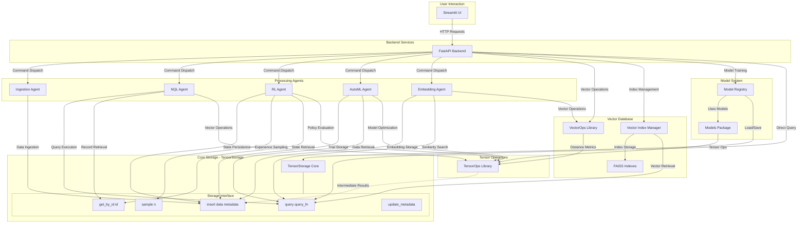

# Tensorus: Agentic Tensor Database/Data Lake

Tensorus is a specialized data platform focused on the management and agent-driven manipulation of tensor data. It offers a streamlined environment for storing, retrieving, and operating on tensors, laying the groundwork for advanced AI and machine learning workflows.

The core purpose of Tensorus is to simplify and enhance how developers and AI agents interact with tensor datasets. By providing dedicated tools for tensor operations and a framework for agentic integration, Tensorus aims to accelerate tasks like automated data ingestion, reinforcement learning from stored experiences, and AutoML processes, ultimately enabling more efficient and intelligent data utilization in AI projects.

## Key Features

*   **Tensor Storage:** Efficiently store and retrieve PyTorch tensors with associated metadata.
*   **Vector Database Capabilities:** Full vector database integration with embedding generation, similarity search, and approximate nearest neighbor indexing.
    *   **Embedding Generation:** Support for sentence-transformers and OpenAI models with automatic caching.
    *   **Similarity Search:** Cosine, Euclidean, and Manhattan distance metrics with fast vector operations.
    *   **Vector Indexing:** FAISS-based approximate nearest neighbor search (Flat, IVF, HNSW indexes).
    *   **Hybrid Search:** Combine semantic similarity with metadata filtering for powerful search capabilities.
*   **Dataset Schemas:** Optional per-dataset schemas enforce required metadata fields and tensor shape/dtype.
*   **Natural Query Language (NQL):** Query your tensor data using a simple, natural language-like syntax.
*   **Agent Framework:** A foundation for building and integrating intelligent agents that interact with your data.
    *   **Data Ingestion Agent:** Automatically monitors a directory for new files and ingests them as tensors.
    *   **RL Agent:** A Deep Q-Network (DQN) agent that can learn from experiences stored in TensorStorage.
    *   **AutoML Agent:** Performs hyperparameter optimization for a dummy model using random search.
    *   **Embedding Agent:** Generates and manages text embeddings with multiple model backends.
*   **API-Driven:** A FastAPI backend provides a RESTful API for interacting with Tensorus, including comprehensive vector database endpoints.
*   **Streamlit UI:** A user-friendly Streamlit frontend for exploring data and controlling agents.
*   **Tensor Operations:** A comprehensive library of robust tensor operations for common manipulations. See [Basic Tensor Operations](#basic-tensor-operations) for details.
*   **Model System:** Optional model registry with example models provided in a
    separate package. See [Tensorus Models](https://github.com/tensorus/models).
*   **Metadata System:** Rich Pydantic schemas and storage backends for semantic, lineage, computational, quality, relational, and usage metadata.
*   **Extensible:** Designed to be extended with more advanced agents, storage backends, and query capabilities.
*   **Model Context Protocol (MCP) Integration:** Available as a separate package at [tensorus/mcp](https://github.com/tensorus/mcp) for AI agents and LLMs that need standardized protocol access to Tensorus capabilities.

## Project Structure

*   `app.py`: The main Streamlit frontend application (located at the project root).
*   `pages/`: Directory containing individual Streamlit page scripts and shared UI utilities for the dashboard.
    *   `pages/ui_utils.py`: Utility functions specifically for the Streamlit UI.
    *   *(Other page scripts like `01_dashboard.py`, `02_control_panel.py`, etc., define the different views of the dashboard)*
*   `tensorus/`: Directory containing the core `tensorus` library modules (this is the main installable package).
    *   `tensorus/__init__.py`: Makes `tensorus` a Python package.
    *   `tensorus/api.py`: The FastAPI application providing the backend API for Tensorus.
    *   `tensorus/tensor_storage.py`: Core TensorStorage implementation for managing tensor data.
    *   `tensorus/tensor_ops.py`: Library of functions for tensor manipulations.
    *   `tensorus/vector_ops.py`: Specialized vector operations for similarity search and distance metrics.
    *   `tensorus/embedding_agent.py`: Agent for generating and managing text embeddings.
    *   `tensorus/vector_index.py`: FAISS-based vector indexing for approximate nearest neighbor search.
    *   `tensorus/nql_agent.py`: Agent for processing Natural Query Language queries.
    *   `tensorus/ingestion_agent.py`: Agent for ingesting data from various sources.
    *   `tensorus/rl_agent.py`: Agent for Reinforcement Learning tasks.
    *   `tensorus/automl_agent.py`: Agent for AutoML processes.
    *   `tensorus/dummy_env.py`: A simple environment for the RL agent demonstration.
    *   *(Other Python files within `tensorus/` are part of the core library.)*
*   `requirements.txt`: Lists the project's Python dependencies for development and local execution.
*   `pyproject.toml`: Project metadata, dependencies for distribution, and build system configuration (e.g., for PyPI).
*   `README.md`: This file.
*   `LICENSE`: Project license file.
*   `.gitignore`: Specifies intentionally untracked files that Git should ignore.

## Huggingface Demo

You can try Tensorus online via Huggingface Spaces:

*   **API Documentation:** [Swagger UI](https://tensorus-api.hf.space/docs) | [ReDoc](https://tensorus-api.hf.space/redoc)

*   **Dashboard UI:** [Streamlit Dashboard](https://tensorus-dashboard.hf.space)

## Demos

For Model Context Protocol integration examples and demos, see the separate [Tensorus MCP repository](https://github.com/tensorus/mcp).

## Tensorus Execution Cycle




## Getting Started

### Prerequisites

*   Python 3.10+
*   PyTorch
*   FastAPI
*   Uvicorn
*   Streamlit
*   Pydantic v2
*   Requests
*   Pillow (for image preprocessing)
*   Matplotlib (optional, for plotting RL rewards)
*   sentence-transformers (for embedding generation)
*   faiss-cpu or faiss-gpu (for vector indexing)
*   openai (optional, for OpenAI embeddings)
*   tiktoken (for OpenAI tokenization)

### Installation

1.  Clone the repository:

    ```bash
    git clone https://github.com/tensorus/tensorus.git
    cd tensorus
    ```

2.  Create a virtual environment (recommended):

    ```bash
    python3 -m venv venv
    source venv/bin/activate  # On Linux/macOS
    venv\Scripts\activate  # On Windows
    ```

3.  Install dependencies using the provided setup script:

    ```bash
    ./setup.sh
    ```
    This installs Python requirements from `requirements.txt` and
    `requirements-test.txt`, using CPU wheels for PyTorch and
    pinning `httpx` to a compatible version. The test requirements
    also install `fastapi>=0.110` for compatibility with Pydantic v2.
    The script also installs test requirements for running the Python test suite.
    Heavy machine-learning libraries (e.g. `xgboost`, `lightgbm`, `catboost`,
    `statsmodels`, `torch-geometric`) are not installed by default. Install
    them separately using `pip install tensorus[models]` or by installing the
    `tensorus-models` package if you need the built-in models.
    The audit logger writes to `tensorus_audit.log` by default. Override the
    path with the `TENSORUS_AUDIT_LOG_PATH` environment variable if desired.

### Running the API Server

1.  Navigate to the project root directory (the directory containing the `tensorus` folder and `pyproject.toml`).
2.  Ensure your virtual environment is activated if you are using one.
3.  Start the FastAPI backend server using:

    ```bash
    uvicorn tensorus.api:app --host 0.0.0.0 --port 7860
    ```

    *   This command launches Uvicorn with the `app` instance defined in `tensorus/api.py`.
    *   Access the API documentation at `http://localhost:7860/docs` or `http://localhost:7860/redoc`.
    *   All dataset and agent endpoints are available once the server is running.

    To use S3 for tensor dataset persistence instead of local disk, set:

    ```bash
    export TENSORUS_TENSOR_STORAGE_PATH="s3://your-bucket/optional/prefix"
    # Ensure AWS credentials are available (env vars, profile, or instance role)
    uvicorn tensorus.api:app --host 0.0.0.0 --port 7860
    ```

### Running the Streamlit UI

1.  In a separate terminal (with the virtual environment activated), navigate to the project root.
2.  Start the Streamlit frontend:

    ```bash
    streamlit run app.py
    ```

    *   Access the UI in your browser at the URL provided by Streamlit (usually `http://localhost:8501`).

### Model Context Protocol Integration

For AI agents and LLMs that need standardized protocol access to Tensorus capabilities, see the separate [Tensorus MCP package](https://github.com/tensorus/mcp) which provides a complete MCP server implementation.


### Running the Agents (Examples)

You can run the example agents directly from their respective files:

*   **RL Agent:**

    ```bash
    python tensorus/rl_agent.py
    ```

*   **AutoML Agent:**

    ```bash
    python tensorus/automl_agent.py
    ```

*   **Ingestion Agent:**

    ```bash
    python tensorus/ingestion_agent.py
    ```

    *   Note: The Ingestion Agent will monitor the `temp_ingestion_source` directory (created automatically if it doesn't exist in the project root) for new files.

### Docker Quickstart

Run Tensorus with Docker in two ways: a single container (in‑memory storage) or a full stack with PostgreSQL via Docker Compose.

#### Option A: Full stack with PostgreSQL (recommended)
1. Install Docker Desktop (or Docker Engine) and Docker Compose v2.
2. Generate an API key:

   ```bash
   python generate_api_key.py --format env
   # Copy the value printed after TENSORUS_API_KEYS=
   ```

3. Open `docker-compose.yml` and set your key. Either:
   - Replace the placeholder in `TENSORUS_VALID_API_KEYS` with your key, or
   - Add `TENSORUS_API_KEYS: "tsr_..."` alongside it. Both are supported; `TENSORUS_API_KEYS` is preferred.

4. Start the stack from the project root:

   ```bash
   docker compose up --build
   ```

   - The API starts on `http://localhost:7860`
   - PostgreSQL is exposed on host `5433` (container `5432`)
   - Audit logs are persisted to `./tensorus_audit.log` via a bind mount

5. Test authentication (Bearer token is recommended):

   ```bash
   # Replace tsr_your_key with the key you generated
   curl -H "Authorization: Bearer tsr_your_key" http://localhost:7860/datasets
   ```

Notes
- The compose file waits for Postgres to become healthy before starting the app.
- Legacy header `X-API-KEY: tsr_your_key` is still accepted for backward compatibility.

Useful commands
```bash
# View logs
docker compose logs -f app

# Rebuild after code changes
docker compose up --build --force-recreate

# Stop stack
docker compose down
```

#### Option B: Single container (in‑memory storage)
Use this for quick, ephemeral testing without Postgres.

```bash
docker build -t tensorus .
docker run --rm -p 7860:7860 \
  -e TENSORUS_AUTH_ENABLED=true \
  -e TENSORUS_API_KEYS=tsr_your_key \
  -e TENSORUS_STORAGE_BACKEND=in_memory \
  -v "$(pwd)/tensorus_audit.log:/app/tensorus_audit.log" \
  tensorus
```

Then open `http://localhost:7860/docs`.

WSL2 tip: If you run Docker Desktop on Windows with WSL2, `localhost:7860` works from both Windows and the WSL distro. Keep volumes on the Linux side (`/home/...`) for best performance.

#### GPU acceleration (optional)
The default image uses CPU wheels. For GPUs, install the NVIDIA Container Toolkit and switch to CUDA‑enabled PyTorch wheels in your build (e.g., modify `setup.sh` or your Dockerfile). Pass `--gpus all` to `docker run`.

### Environment configuration (reference)
Tensorus reads configuration from environment variables (prefix `TENSORUS_`). Common settings:

- Authentication
  - `TENSORUS_AUTH_ENABLED` (default: `true`)
  - `TENSORUS_API_KEYS`: Comma‑separated list of keys (preferred)
  - `TENSORUS_VALID_API_KEYS`: Legacy alternative; comma list or JSON array
  - Usage: Prefer `Authorization: Bearer tsr_...`; legacy header is supported and configurable via `TENSORUS_API_KEY_HEADER_NAME`

- Metadata storage backend (separate from tensor data persistence)
  - `TENSORUS_STORAGE_BACKEND`: `in_memory` | `postgres` (default: `in_memory`)
  - Postgres when `postgres`:
    - `TENSORUS_POSTGRES_HOST`, `TENSORUS_POSTGRES_PORT` (default `5432`),
      `TENSORUS_POSTGRES_USER`, `TENSORUS_POSTGRES_PASSWORD`, `TENSORUS_POSTGRES_DB`
    - or `TENSORUS_POSTGRES_DSN` (overrides individual fields)

- Tensor data persistence (optional, independent of metadata backend)
  - `TENSORUS_TENSOR_STORAGE_PATH`: Local directory path (e.g., `/app/tensor_data`) or `s3://bucket/prefix` (requires AWS credentials and boto3)

- Security headers
  - `TENSORUS_X_FRAME_OPTIONS` (default `SAMEORIGIN`; set to `NONE` to omit)
  - `TENSORUS_CONTENT_SECURITY_POLICY` (default `default-src 'self'`; set to `NONE` to omit)

- Misc
  - `TENSORUS_AUDIT_LOG_PATH` (default `tensorus_audit.log`)
  - `TENSORUS_MINIMAL_IMPORT`=1 to skip optional model package imports
  - NQL with LLM: `NQL_USE_LLM=true`, `GOOGLE_API_KEY`, optional `NQL_LLM_MODEL`

Example `.env` (for local runs or compose env_file):
```bash
TENSORUS_AUTH_ENABLED=true
TENSORUS_API_KEYS=tsr_your_key
TENSORUS_STORAGE_BACKEND=postgres
TENSORUS_POSTGRES_HOST=db
TENSORUS_POSTGRES_PORT=5432
TENSORUS_POSTGRES_USER=tensorus_user
TENSORUS_POSTGRES_PASSWORD=change_me
TENSORUS_POSTGRES_DB=tensorus_db
TENSORUS_AUDIT_LOG_PATH=/app/tensorus_audit.log
```

### Production deployment with Docker (step‑by‑step)
This example uses Docker Compose with PostgreSQL. Adjust for your infra as needed.

1. Generate and store your API key securely
   - `python generate_api_key.py --format env`
   - Prefer secret management (Docker/Swarm/K8s/Vault). For Compose, you can use a file‑based secret:

     ```bash
     # secrets/api_key.txt contains only your key value (no quotes)
     echo "tsr_prod_key_..." > secrets/api_key.txt
     ```

2. Configure Compose for production
   - Edit `docker-compose.yml` and set:
     - `TENSORUS_AUTH_ENABLED: "true"`
     - `TENSORUS_API_KEYS: ${TENSORUS_API_KEYS:-}` or point to a secret/file
     - `TENSORUS_STORAGE_BACKEND: postgres` and your Postgres credentials
     - (Optional tensor persistence) Mount a volume and set `TENSORUS_TENSOR_STORAGE_PATH: /app/tensor_data`
   - Optionally add `env_file: .env` and put non‑secret config there.

3. Harden runtime
   - Put Tensorus behind a reverse proxy (Nginx/Traefik) with TLS
   - Restrict CORS/hosts at the proxy; the app currently allows all by default
   - Set security headers via env vars (see below)

4. Start and verify
   ```bash
   docker compose up -d --build
   docker compose ps
   curl -f -H "Authorization: Bearer tsr_prod_key_..." http://localhost:7860/ || echo "API not ready"
   ```

5. Health and logs
   - Postgres health is checked automatically; the app waits until healthy
   - `docker compose logs -f app`

Security headers
- Override defaults to match your CSP and embedding needs. If set to `NONE` or empty, the header is omitted.

```bash
# Example: allow Swagger/ReDoc CDNs and a trusted frame host
TENSORUS_X_FRAME_OPTIONS="ALLOW-FROM https://example.com"
TENSORUS_CONTENT_SECURITY_POLICY="default-src 'self'; script-src 'self' https://cdn.jsdelivr.net; style-src 'self' https://fonts.googleapis.com 'unsafe-inline'; font-src 'self' https://fonts.gstatic.com; img-src 'self' https://fastapi.tiangolo.com"
```

Troubleshooting
- 401 Unauthorized: ensure you send `Authorization: Bearer tsr_...` and the key is configured (`TENSORUS_API_KEYS` or `TENSORUS_VALID_API_KEYS`).
- 503 auth not configured: set an API key when auth is enabled.
- DB connection errors: verify Postgres env, port conflicts (host 5433 vs local 5432), and that the DB user/database exist.
- Windows/WSL2 volume performance: keep bind‑mounted files on the Linux filesystem for best performance.

### Preparing the Test Environment

The tests expect all dependencies from both `requirements.txt` and
`requirements-test.txt` to be installed. A simple setup script is provided
to handle this automatically:

```bash
./setup.sh
```

Run this after creating and activating a Python virtual environment. The script
installs the Tensorus runtime requirements and the additional packages needed
for `pytest`. Once completed, executing `pytest` from the repository root will
automatically discover and run the entire suite—no manual package discovery is
required.

### Test Suite Dependencies

The Python tests rely on packages from both `requirements.txt` and
`requirements-test.txt`. The latter includes `httpx` and other packages
used by the test suite. **Always run `./setup.sh` before executing
`pytest` to install these requirements**:

```bash
./setup.sh
```

### Running Tests

Tensorus includes Python unit tests. To set up the environment and run them:

1. Install all dependencies using the setup script **before running any tests**:

    ```bash
    ./setup.sh
    ```

    This script installs packages from `requirements.txt` and `requirements-test.txt` (which pins `fastapi>=0.110` for Pydantic v2 support).

2. Run the Python test suite:

    ```bash
    pytest
    ```

    All tests should pass without errors when dependencies are properly installed.


## Using Tensorus
### API Endpoints

The API provides the following main endpoints:

*   **Datasets:**
    *   `POST /datasets/create`: Create a new dataset.
    *   `POST /datasets/{name}/ingest`: Ingest a tensor into a dataset.
    *   `GET /datasets/{name}/fetch`: Retrieve all records from a dataset.
    *   `GET /datasets/{name}/records`: Retrieve a page of records. Supports `offset` (start index, default `0`) and `limit` (max results, default `100`).
    *   `GET /datasets`: List all available datasets.
*   **Vector Database:**
    *   `POST /vector/embed`: Generate and store text embeddings.
    *   `POST /vector/search`: Perform similarity search on embeddings.
    *   `POST /vector/hybrid-search`: Combine semantic and metadata search.
    *   `POST /vector/index/build`: Build FAISS indexes for fast search.
    *   `POST /vector/index/search`: Search using pre-built indexes.
    *   `GET /vector/index/list`: List available vector indexes.
    *   `DELETE /vector/index/{name}`: Delete a vector index.
    *   `GET /vector/models`: List supported embedding models.
*   **Querying:**
    *   `POST /query`: Execute an NQL query.
*   **Agents:**
    *   `GET /agents`: List all registered agents.
    *   `GET /agents/{agent_id}/status`: Get the status of a specific agent.
    *   `POST /agents/{agent_id}/start`: Start an agent.
    *   `POST /agents/{agent_id}/stop`: Stop an agent.
    *   `GET /agents/{agent_id}/logs`: Get recent logs for an agent.
*   **Metrics & Monitoring:**
    *   `GET /metrics/dashboard`: Get aggregated dashboard metrics.

### Dataset Schemas

Datasets can optionally include a schema when created. The schema defines required metadata fields and expected tensor `shape` and `dtype`. Inserts that violate the schema will raise a validation error.
required metadata fields and expected tensor `shape` and `dtype`. Inserts that
violate the schema will raise a validation error.

Example:

```python
schema = {
    "shape": [3, 10],
    "dtype": "float32",
    "metadata": {"source": "str", "value": "int"}
}
storage.create_dataset("my_ds", schema=schema)
storage.insert("my_ds", torch.rand(3, 10), {"source": "sensor", "value": 5})
```

## Metadata System

Tensorus includes a detailed metadata subsystem for describing tensors beyond their raw data. Each tensor has a `TensorDescriptor` and can be associated with optional semantic, lineage, computational, quality, relational, and usage metadata. The metadata storage backend is pluggable, supporting in-memory storage for quick testing or PostgreSQL for persistence. Search and aggregation utilities allow querying across these metadata fields. See [metadata_schemas.md](docs/metadata_schemas.md) for schema details.

### Streamlit UI


The Streamlit UI provides a user-friendly interface for:

*   **Dashboard:** View basic system metrics and agent status.
*   **Agent Control:** Start, stop, and view logs for agents.
*   **NQL Chat:** Enter natural language queries and view results.
*   **Data Explorer:** Browse datasets, preview data, and perform tensor operations.

## Natural Query Language (NQL)

Tensorus ships with a simple regex‑based Natural Query Language for retrieving
tensors by metadata. You can issue NQL queries via the API or from the "NQL
Chat" page in the Streamlit UI.

### Enabling LLM rewriting

Set `NQL_USE_LLM=true` to enable parsing of free‑form queries with
Google's Gemini model. Provide your API key in the `GOOGLE_API_KEY`
environment variable and optionally set `NQL_LLM_MODEL` (defaults to
`gemini-2.0-flash`) to choose the model version. The agent sends the
current dataset schema and your query to Gemini via
`langchain-google`. If the model or key are unavailable the agent
silently falls back to the regex-based parser.

Example query using the LLM parser:

```text
show me all images containing a dog from dataset animals where source is "mobile"
```

This phrasing is more natural than the regex format and will be
rewritten into a structured NQL query by Gemini.

## Agent Details

### Data Ingestion Agent

*   **Functionality:** Monitors a source directory for new files, preprocesses them into tensors, and inserts them into TensorStorage.
*   **Supported File Types:** CSV, PNG, JPG, JPEG, TIF, TIFF (can be extended).
*   **Preprocessing:** Uses default functions for CSV and images (resize, normalize).
*   **Configuration:**
    *   `source_directory`: The directory to monitor.
    *   `polling_interval_sec`: How often to check for new files.
    *   `preprocessing_rules`: A dictionary mapping file extensions to custom preprocessing functions.

### RL Agent

*   **Functionality:** A Deep Q-Network (DQN) agent that learns from experiences stored in TensorStorage.
*   **Environment:** Uses a `DummyEnv` for demonstration.
*   **Experience Storage:** Stores experiences (state, action, reward, next_state, done) in TensorStorage.
*   **Training:** Implements epsilon-greedy exploration and target network updates.
*   **Configuration:**
    *   `state_dim`: Dimensionality of the environment state.
    *   `action_dim`: Number of discrete actions.
    *   `hidden_size`: Hidden layer size for the DQN.
    *   `lr`: Learning rate.
    *   `gamma`: Discount factor.
    *   `epsilon_*`: Epsilon-greedy parameters.
    *   `target_update_freq`: Target network update frequency.
    *   `batch_size`: Experience batch size.
    *   `experience_dataset`: Dataset name for experiences.
    *   `state_dataset`: Dataset name for state tensors.

### AutoML Agent

*   **Functionality:** Performs hyperparameter optimization using random search.
*   **Model:** Trains a simple `DummyMLP` model.
*   **Search Space:** Configurable hyperparameter search space (learning rate, hidden size, activation).
*   **Evaluation:** Trains and evaluates models on synthetic data.
*   **Results:** Stores trial results (parameters, score) in TensorStorage.
*   **Configuration:**
    *   `search_space`: Dictionary defining the hyperparameter search space.
    *   `input_dim`: Input dimension for the model.
    *   `output_dim`: Output dimension for the model.
    *   `task_type`: Type of task ('regression' or 'classification').
    *   `results_dataset`: Dataset name for storing results.


### Tensorus Models

The collection of example models previously bundled with Tensorus now lives in
a separate repository: [tensorus/models](https://github.com/tensorus/models).
Install it with:

```bash
pip install tensorus-models
```

When the package is installed, Tensorus will automatically import it. Set the
environment variable `TENSORUS_MINIMAL_IMPORT=1` before importing Tensorus to
skip this optional dependency and keep startup lightweight.

## Basic Tensor Operations

This section details the core tensor manipulation functionalities provided by `tensor_ops.py`. These operations are designed to be robust, with built-in type and shape checking where appropriate.

#### Arithmetic Operations

*   `add(t1, t2)`: Element-wise addition of two tensors, or a tensor and a scalar.
*   `subtract(t1, t2)`: Element-wise subtraction of two tensors, or a tensor and a scalar.
*   `multiply(t1, t2)`: Element-wise multiplication of two tensors, or a tensor and a scalar.
*   `divide(t1, t2)`: Element-wise division of two tensors, or a tensor and a scalar. Includes checks for division by zero.
*   `power(t1, t2)`: Raises each element in `t1` to the power of `t2`. Supports tensor or scalar exponents.
*   `log(tensor)`: Element-wise natural logarithm with warnings for non-positive values.

#### Matrix and Dot Operations

*   `matmul(t1, t2)`: Matrix multiplication of two tensors, supporting various dimensionalities (e.g., 2D matrices, batched matrix multiplication).
*   `dot(t1, t2)`: Computes the dot product of two 1D tensors.
*   `outer(t1, t2)`: Computes the outer product of two 1‑D tensors.
*   `cross(t1, t2, dim=-1)`: Computes the cross product along the specified dimension (size must be 3).
*   `matrix_eigendecomposition(matrix_A)`: Returns eigenvalues and eigenvectors of a square matrix.
*   `matrix_trace(matrix_A)`: Computes the trace of a 2-D matrix.
*   `tensor_trace(tensor_A, axis1=0, axis2=1)`: Trace of a tensor along two axes.
*   `svd(matrix)`: Singular value decomposition of a matrix, returns `U`, `S`, and `Vh`.
*   `qr_decomposition(matrix)`: QR decomposition returning `Q` and `R`.
*   `lu_decomposition(matrix)`: LU decomposition returning permutation `P`, lower `L`, and upper `U` matrices.
*   `cholesky_decomposition(matrix)`: Cholesky factor of a symmetric positive-definite matrix.
*   `matrix_inverse(matrix)`: Inverse of a square matrix.
*   `matrix_determinant(matrix)`: Determinant of a square matrix.
*   `matrix_rank(matrix)`: Rank of a matrix.

#### Reduction Operations

*   `sum(tensor, dim=None, keepdim=False)`: Computes the sum of tensor elements over specified dimensions.
*   `mean(tensor, dim=None, keepdim=False)`: Computes the mean of tensor elements over specified dimensions. Tensor is cast to float for calculation.
*   `min(tensor, dim=None, keepdim=False)`: Finds the minimum value in a tensor, optionally along a dimension. Returns values and indices if `dim` is specified.
*   `max(tensor, dim=None, keepdim=False)`: Finds the maximum value in a tensor, optionally along a dimension. Returns values and indices if `dim` is specified.
*   `variance(tensor, dim=None, unbiased=False, keepdim=False)`: Variance of tensor elements.
*   `covariance(matrix_X, matrix_Y=None, rowvar=True, bias=False, ddof=None)`: Covariance matrix estimation.
*   `correlation(matrix_X, matrix_Y=None, rowvar=True)`: Correlation coefficient matrix.

#### Reshaping and Slicing

*   `reshape(tensor, shape)`: Changes the shape of a tensor without changing its data.
*   `transpose(tensor, dim0, dim1)`: Swaps two dimensions of a tensor.
*   `permute(tensor, dims)`: Permutes the dimensions of a tensor according to the specified order.
*   `flatten(tensor, start_dim=0, end_dim=-1)`: Flattens a range of dimensions into a single dimension.
*   `squeeze(tensor, dim=None)`: Removes dimensions of size 1, or a specific dimension if provided.
*   `unsqueeze(tensor, dim)`: Inserts a dimension of size 1 at the given position.

#### Concatenation and Splitting

*   `concatenate(tensors, dim=0)`: Joins a sequence of tensors along an existing dimension.
*   `stack(tensors, dim=0)`: Joins a sequence of tensors along a new dimension.

#### Advanced Operations

*   `einsum(equation, *tensors)`: Applies Einstein summation convention to the input tensors based on the provided equation string.
*   `compute_gradient(func, tensor)`: Returns the gradient of a scalar `func` with respect to `tensor`.
*   `compute_jacobian(func, tensor)`: Computes the Jacobian matrix of a vector function.
*   `convolve_1d(signal_x, kernel_w, mode='valid')`: 1‑D convolution using `torch.nn.functional.conv1d`.
*   `convolve_2d(image_I, kernel_K, mode='valid')`: 2‑D convolution using `torch.nn.functional.conv2d`.
 *   `frobenius_norm(tensor)`: Calculates the Frobenius norm.
 *   `l1_norm(tensor)`: Calculates the L1 norm (sum of absolute values).

## Tensor Decomposition Operations

Tensorus includes a library of higher‑order tensor factorizations in
`tensor_decompositions.py`. These operations mirror the algorithms
available in TensorLy and related libraries.

* **CP Decomposition** – Canonical Polyadic factorization returning
  weights and factor matrices.
* **NTF‑CP Decomposition** – Non‑negative CP using
  `non_negative_parafac`.
* **Tucker Decomposition** – Standard Tucker factorization for specified
  ranks.
* **Non‑negative Tucker / Partial Tucker** – Variants with HOOI and
  non‑negative constraints.
* **HOSVD** – Higher‑order SVD (Tucker with full ranks).
* **Tensor Train (TT)** – Sequence of TT cores representing the tensor.
* **TT‑SVD** – TT factorization via SVD initialization.
* **Tensor Ring (TR)** – Circular variant of TT.
* **Hierarchical Tucker (HT)** – Decomposition using a dimension tree.
* **Block Term Decomposition (BTD)** – Sum of Tucker‑1 terms for 3‑way
  tensors.
* **t‑SVD** – Tensor singular value decomposition based on the
  t‑product.

Examples of how to call these methods are provided in
[`tensorus/tensor_decompositions.py`](tensorus/tensor_decompositions.py).


## Vector Database Operations

Tensorus includes comprehensive vector database capabilities that rival dedicated vector databases like Pinecone and Weaviate. The vector database integration provides:

### Core Vector Operations (`vector_ops.py`)

*   `cosine_similarity(vec1, vec2)`: Computes cosine similarity between two vectors.
*   `cosine_similarity_batch(vectors1, vectors2)`: Batch cosine similarity computation.
*   `euclidean_distance(vec1, vec2)`: Euclidean distance between vectors.
*   `manhattan_distance(vec1, vec2)`: Manhattan (L1) distance between vectors.
*   `hamming_distance(vec1, vec2)`: Hamming distance for binary vectors.
*   `top_k_similarity(query, vectors, k)`: Find k most similar vectors to query.
*   `normalize_vectors(vectors)`: L2 normalization of vectors.
*   `vector_angle(vec1, vec2)`: Angle between two vectors in radians.
*   `pairwise_distance_matrix(vectors, metric)`: Compute pairwise distance matrix.

### Embedding Generation (`embedding_agent.py`)

*   **Multiple Model Support**: sentence-transformers, OpenAI embeddings
*   **Model Caching**: Automatic caching of loaded models for efficiency
*   **Embedding Caching**: Cache computed embeddings to avoid recomputation
*   **Batch Processing**: Efficient batch encoding of multiple texts
*   **Storage Integration**: Seamless integration with TensorStorage

Supported Models:
- `all-MiniLM-L6-v2` (384 dimensions) - Fast and efficient
- `all-mpnet-base-v2` (768 dimensions) - High quality embeddings
- `text-embedding-ada-002` (1536 dimensions) - OpenAI's general-purpose model
- `text-embedding-3-small/large` - OpenAI's latest models

### Vector Indexing (`vector_index.py`)

*   **FAISS Integration**: Fast approximate nearest neighbor search
*   **Multiple Index Types**:
    - **Flat Index**: Exact search for small datasets (<10K vectors)
    - **IVF Index**: Inverted file index for medium datasets (10K-1M vectors)
    - **HNSW Index**: Hierarchical navigable small world for large datasets (>100K vectors)
*   **Persistent Storage**: Save and load indexes to/from disk
*   **Metadata Integration**: Associate metadata with indexed vectors

### API Endpoints

The vector database provides comprehensive REST API endpoints:

*   `POST /vector/embed`: Generate embeddings from text
*   `POST /vector/search`: Similarity search in embedding space
*   `POST /vector/hybrid-search`: Combine semantic and metadata search
*   `POST /vector/index/build`: Build FAISS indexes for fast search
*   `POST /vector/index/search`: Search using pre-built indexes
*   `GET /vector/index/list`: List available indexes
*   `DELETE /vector/index/{name}`: Delete vector indexes
*   `GET /vector/models`: List supported embedding models

### Usage Examples

```python
from tensorus.embedding_agent import EmbeddingAgent
from tensorus.vector_index import VectorIndexManager
from tensorus.tensor_storage import TensorStorage

# Initialize components
storage = TensorStorage()
agent = EmbeddingAgent(storage)
index_manager = VectorIndexManager(storage)

# Generate and store embeddings
texts = ["Machine learning", "Deep learning", "Neural networks"]
result = agent.encode_and_store(
    texts=texts,
    dataset_name="ai_concepts",
    model_name="all-MiniLM-L6-v2"
)

# Build fast search index
index = index_manager.build_index(
    dataset_name="ai_concepts",
    index_type="hnsw",
    metric="cosine"
)

# Perform similarity search
results = index_manager.search_index(
    index_name="ai_concepts_hnsw",
    query="artificial intelligence",
    k=5
)
```

For detailed usage instructions, see [`docs/vector_database_guide.md`](docs/vector_database_guide.md).

## Completed Features

The current codebase implements all of the items listed in
[Key Features](#key-features). Tensorus provides efficient tensor
storage with optional file persistence, comprehensive vector database capabilities,
a natural query language, a flexible agent framework, a RESTful API, a Streamlit UI, 
and robust tensor operations. The modular architecture makes future extensions straightforward.

**Recently Added Vector Database Features:**
*   ✅ **Vector Operations Library** - Complete similarity and distance metrics
*   ✅ **Embedding Generation** - Support for sentence-transformers and OpenAI models  
*   ✅ **FAISS Integration** - Approximate nearest neighbor indexing (Flat, IVF, HNSW)
*   ✅ **Hybrid Search** - Semantic similarity combined with metadata filtering
*   ✅ **REST API Endpoints** - Full vector database API (`/vector/*`)
*   ✅ **Comprehensive Testing** - Complete test coverage for all vector components

## Future Implementation

*   **Enhanced NQL:** Integrate a local or remote LLM for more robust natural language understanding.
*   **Advanced Agents:** Develop more sophisticated agents for specific tasks (e.g., anomaly detection, forecasting).
*   **Persistent Storage Backend:** Replace/augment current file-based persistence with more robust database or cloud storage solutions (e.g., PostgreSQL, S3, MinIO).
*   **Scalability & Performance:**
    *   Implement tensor chunking for very large tensors.
    *   Optimize query performance with indexing.
    *   Asynchronous operations for agents and API calls.
*   **Security:** Implement authentication and authorization mechanisms for the API and UI.
*   **Real-World Integration:**
    *   Connect Ingestion Agent to more data sources (e.g., cloud storage, databases, APIs).
    *   Integrate RL Agent with real-world environments or more complex simulations.
*   **Advanced AutoML:**
    *   Implement sophisticated search algorithms (e.g., Bayesian Optimization, Hyperband).
    *   Support for diverse model architectures and custom models.
*   **Model Management:** Add capabilities for saving, loading, versioning, and deploying trained models (from RL/AutoML).
*   **Streaming Data Support:** Enhance Ingestion Agent to handle real-time streaming data.
*   **Resource Management:** Add tools and controls for monitoring and managing the resource consumption (CPU, memory) of agents.
*   **Improved UI/UX:** Continuously refine the Streamlit UI for better usability and richer visualizations.
*   **Comprehensive Testing:** Expand unit, integration, and end-to-end tests.

## Contributing

Contributions are welcome! Please feel free to open issues or submit pull requests.

## License

MIT License
