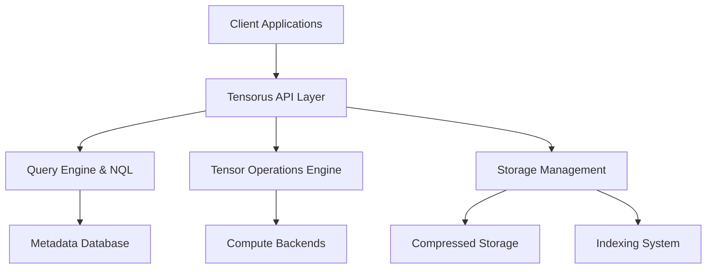

# Tensorus Documentation Hub

Welcome to Tensorus, the world's first production-ready **Enterprise Tensor Database Platform**. Purpose-built for high-performance machine learning and AI applications, Tensorus transforms how organizations store, process, and analyze tensor data at scale.

## 🚀 Quick Navigation

### New to Tensorus?
- **[Getting Started Guide](getting_started.md)** - Install, configure, and run your first tensors in 15 minutes
- **[Executive Overview](executive_overview.md)** - Product positioning, market opportunity, and business value

### Developers
- **[API Reference](api_reference.md)** - Complete REST API documentation with examples
- **[Integration Guides](integration_guides.md)** - SDKs, frameworks, and third-party integrations
- **[Examples & Tutorials](../examples/)** - Real-world use cases and implementation guides

### Operations Teams  
- **[Production Deployment](production_deployment.md)** - Enterprise deployment strategies and best practices
- **[Performance Benchmarks](performance_benchmarks.md)** - Scaling guide and optimization strategies
- **[Security & Compliance](security_compliance.md)** - Enterprise security and regulatory compliance

### Support & Resources
- **[Troubleshooting Guide](troubleshooting_guide.md)** - Common issues and diagnostic tools
- **[Monitoring & Observability](monitoring_guide.md)** - Production monitoring and alerting
- **[Enterprise Features](enterprise_features.md)** - Advanced capabilities and licensing

## 🎯 What Makes Tensorus Special

### Core Capabilities

- **🔥 10-100x Performance** - Faster than traditional file-based tensor storage
- **📊 Advanced Operations** - 40+ optimized tensor operations with GPU acceleration  
- **🗜️ Smart Compression** - Up to 4x storage savings with intelligent algorithms
- **🔍 Natural Language Queries** - Intuitive NQL interface for data discovery
- **📈 Complete Lineage** - Full computational provenance for ML governance
- **⚡ Real-time Processing** - Streaming operations for massive tensors
- **🏢 Enterprise Ready** - Production-grade security, monitoring, and compliance

### Architecture Highlights

## 📋 Documentation Structure

### Getting Started (15 min read)
1. **[Quick Start](getting_started.md#quick-start-5-minutes)** - 5-minute setup
2. **[Complete Tutorial](getting_started.md#complete-tutorial-building-your-first-ai-application)** - End-to-end ML pipeline
3. **[Web Interface Tour](getting_started.md#web-interface-tour)** - Dashboard and tools

### Core Concepts
- **Tensors & Datasets** - Data organization and management
- **Operations & History** - Computational tracking and lineage  
- **Compression & Indexing** - Performance optimization
- **Natural Language Queries** - Intuitive data discovery

### Production Deployment
- **[Architecture Planning](production_deployment.md#deployment-architecture-options)** - Cloud, on-premise, hybrid options
- **[Security Hardening](production_deployment.md#security-hardening)** - Enterprise security best practices
- **[Monitoring Setup](production_deployment.md#monitoring--observability)** - Prometheus, Grafana, alerting
- **[Backup & Recovery](production_deployment.md#backup--recovery)** - Data protection strategies

### Performance & Scaling
- **[Benchmark Results](performance_benchmarks.md#benchmark-overview)** - Comprehensive performance data
- **[Optimization Guide](performance_benchmarks.md#performance-optimization-guide)** - Tuning for maximum performance
- **[Capacity Planning](performance_benchmarks.md#capacity-planning)** - Resource requirements calculator
- **[Load Testing](performance_benchmarks.md#load-testing)** - Stress testing strategies

## 🔗 Popular Resources

| Resource | Description | Audience |
|----------|-------------|----------|
| **[5-Minute Demo](getting_started.md#quick-start-5-minutes)** | Store, query, and operate on tensors | Everyone |
| **[Production Checklist](production_deployment.md#production-checklist)** | Pre/post deployment validation | DevOps |
| **[API Playground](http://localhost:8000/docs)** | Interactive API documentation | Developers |
| **[Performance Tuning](performance_benchmarks.md#performance-optimization-guide)** | Optimize for your workload | Engineers |
| **[Enterprise Features](enterprise_features.md)** | Advanced capabilities | Decision Makers |

## 🎓 Learning Paths

### For Data Scientists
1. [Getting Started](getting_started.md) → [Complete Tutorial](getting_started.md#complete-tutorial-building-your-first-ai-application)
2. [NQL Examples](api_reference.md#query-tensors-nql) → [Advanced Operations](api_reference.md#tensor-operations-endpoints)  
3. [Python SDK](getting_started.md#python-sdk-deep-dive) → [Real-world Examples](../examples/)

### For ML Engineers  
1. [Architecture Overview](executive_overview.md#technology-stack) → [Performance Benchmarks](performance_benchmarks.md)
2. [Integration Guide](integration_guides.md) → [Monitoring Setup](monitoring_guide.md)
3. [Production Deployment](production_deployment.md) → [Troubleshooting](troubleshooting_guide.md)

### for DevOps Teams
1. [Deployment Options](production_deployment.md#deployment-architecture-options) → [Security Hardening](security_compliance.md)
2. [Monitoring](monitoring_guide.md) → [Performance Tuning](performance_benchmarks.md#performance-optimization-guide)
3. [Backup Strategy](production_deployment.md#backup--recovery) → [Incident Response](troubleshooting_guide.md)

## 🆕 Latest Updates

### Version 0.0.2 (Current)
- ✅ **Compression & Quantization** - Added support for multiple compression algorithms and FP16/INT8 quantization
- ✅ **Documentation Updates** - Improved guides and API references
- ✅ **Testing Improvements** - Expanded test coverage for new functionality

### Roadmap Highlights
- **Near-term**: Operation APIs, storage-operation integration, and indexing improvements
- **Mid-term**: Asynchronous processing, lineage tracking, and discovery APIs
- **Long-term**: Distributed processing and advanced deployment options

## 💬 Community & Support

### Get Help
- **Community Forum**: [community.tensorus.com](https://community.tensorus.com)
- **Discord**: [discord.gg/tensorus](https://discord.gg/tensorus)
- **Stack Overflow**: Tag questions with `tensorus`
- **GitHub Issues**: [github.com/tensorus/tensorus/issues](https://github.com/tensorus/tensorus/issues)

### Enterprise Support
- **Technical Support**: support@tensorus.com
- **Sales Inquiries**: sales@tensorus.com
- **Partnership Opportunities**: partners@tensorus.com
- **Security Reports**: security@tensorus.com

### Contributing
- **Contributing Guide**: [github.com/tensorus/tensorus/blob/main/CONTRIBUTING.md](https://github.com/tensorus/tensorus/blob/main/CONTRIBUTING.md)
- **Code of Conduct**: [github.com/tensorus/tensorus/blob/main/CODE_OF_CONDUCT.md](https://github.com/tensorus/tensorus/blob/main/CODE_OF_CONDUCT.md)
- **Developer Documentation**: [dev.tensorus.com](https://dev.tensorus.com)

## 🏆 Why Choose Tensorus?

### Technical Advantages
- **Purpose-Built**: First database designed specifically for tensor workloads
- **Performance Leader**: 10-100x faster than file-based alternatives
- **Complete Solution**: Storage + Operations + Analytics in one platform
- **Production Proven**: Battle-tested in enterprise environments

### Business Benefits
- **Faster Innovation**: 40-60% faster ML model deployment
- **Cost Reduction**: 30-50% lower total cost of ownership
- **Risk Mitigation**: Complete audit trails for regulatory compliance
- **Future-Proof**: Roadmap aligned with AI/ML industry evolution

---

**Ready to revolutionize your tensor data management?**

Start with our **[5-minute Quick Start](getting_started.md#quick-start-5-minutes)** or explore the **[Complete Tutorial](getting_started.md#complete-tutorial-building-your-first-ai-application)** for a comprehensive introduction.

*Tensorus - Powering the Next Generation of AI Applications* 🚀
